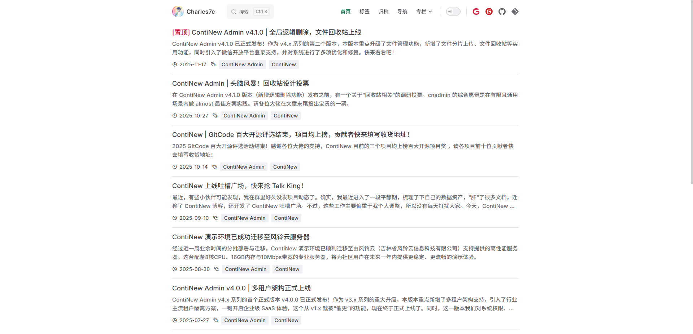
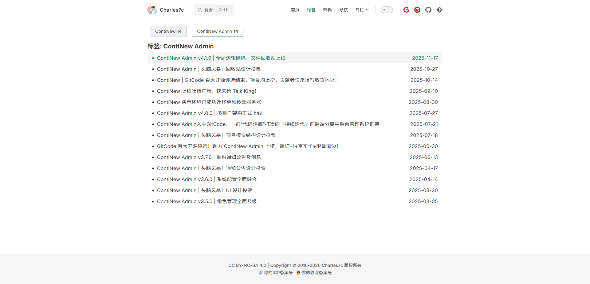
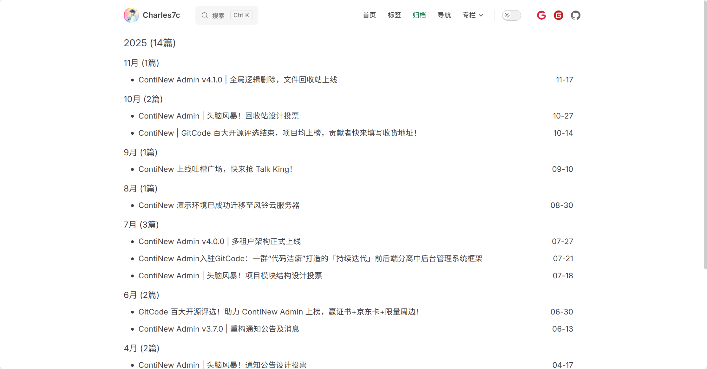
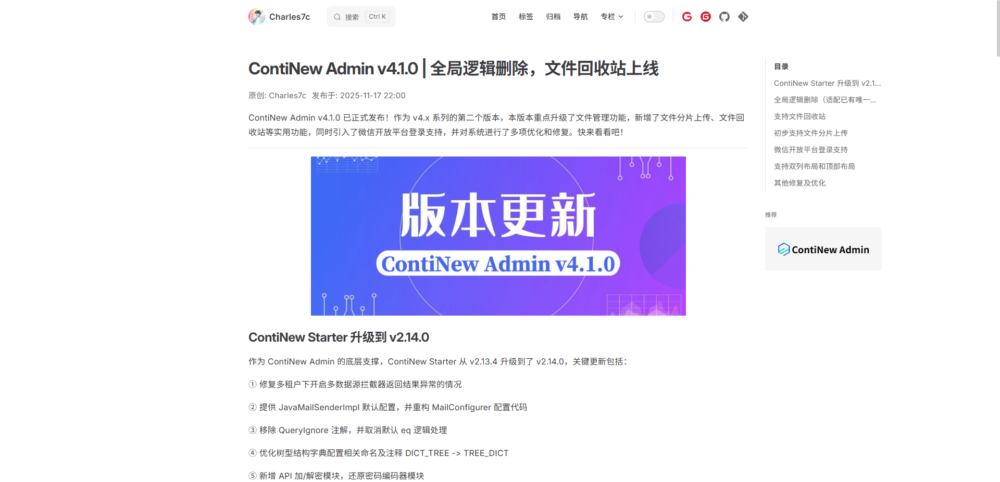
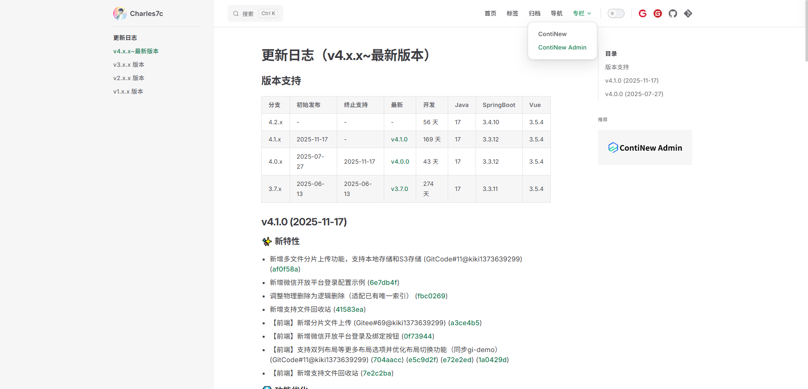
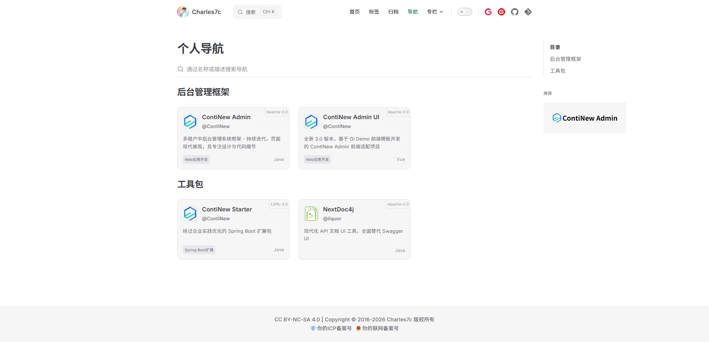

# vitepress-theme-blog-charles7c-s2

<a href="http://creativecommons.org/licenses/by-sa/4.0/" target="_blank">
    
</a>
<a href="https://github.com/Charles7c/vitepress-theme-blog-charles7c-s2/blob/main/LICENSE" target="_blank">
    
</a>

vitepress 知识库主题 - Charles7c 风格2。

## 快速开始

```bash
# 克隆本仓库
git clone https://github.com/Charles7c/vitepress-theme-blog-charles7c-s2
# 安装 PNPM
npm install pnpm -g
# 安装依赖
pnpm install
# dev 运行，访问：http://localhost:5173
pnpm dev
# 打包，文件存放位置：.vitepress/dist
pnpm build
# 部署
# push 到 GitHub 仓库，部署到 GitHub Pages：需要在仓库设置中启用 GitHub Pages
# 在其他平台部署, 例如：Gitee Pages、Vercel、Netlify、个人虚拟主机、个人服务器等
```

文章元数据示例：

```text
---
title: 标题
author: 作者
authorLink: 原作者链接（转载场景）
datetime: 发布时间 yyyy-MM-dd HH:mm
category: 分类（已作废）
tags:
  - 标签一
  - 标签二
top: 是否置顶
draft: 是否为草稿（datetime 为空或 draft 为 true 将不显示在内容中）
---
```

## 已扩展功能（持续优化细节）

- [x] 全局经典博客主题适配，并支持文章时限提醒
- [x] 博客主页：按发布时间分页降序展示博客内容，支持置顶，支持展示 ICP 备案号和公安备案号
- [x] 标签页：按标签归档
- [x] 归档页：按年份、月份归档
- [x] ~~分类页：按分类归档~~
- [x] 支持博客、专栏内容共存
- [x] 个人导航：个人收藏站点
- [x] Markdown 扩展：FootNote、TODO

## 部分页面截图

### 主页



### 标签页



### 归档页



### 博客、专栏内容




### 个人导航



## 特别鸣谢

- [vuejs/vitepress](https://github.com/vuejs/vitepress)
- [vitepress-theme-minimalism](https://github.com/izhichao/vitepress-theme-minimalism)：一个极简的 VitePress 博客主题（本主题基于该主题构建，感谢作者）
- [vitepress-theme-blog-charles7c-s1](https://github.com/Charles7c/vitepress-theme-blog-charles7c-s1)：vitepress 知识库主题 - Charles7c 风格1
- ......

## License

- 文章遵循[ CC 4.0 BY-SA ](http://creativecommons.org/licenses/by-sa/4.0/)版权协议，转载请附上原文出处链接和声明
- 源码遵循 [MIT](https://github.com/Charles7c/vitepress-theme-blog-charles7c-s2/blob/main/LICENSE) 许可协议
- Copyright © 2026 Charles7c
