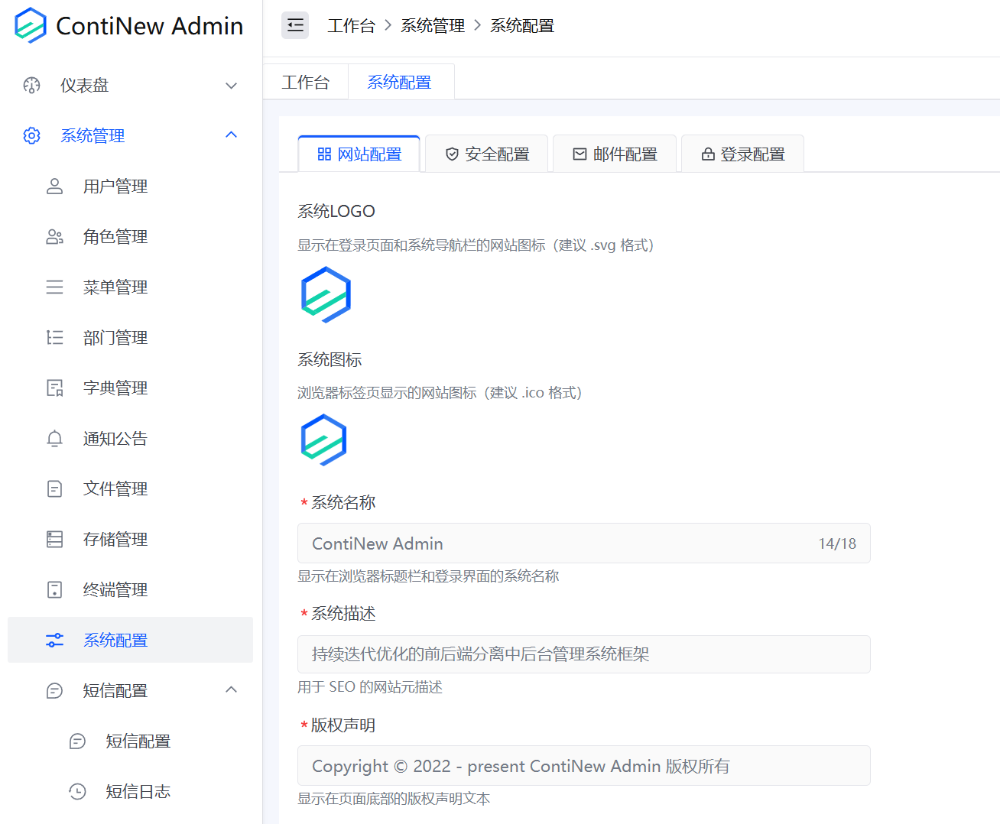

# ContiNew Admin | 头脑风暴！UI 设计投票

各位大佬用户，近期我们维护团队遇到了一些关键的设计和选择问题，这些问题将对项目未来的发展方向产生重要影响。为了能让项目实现更长远的发展，我们决定将这些选择交给更多的人来共同决定。无论您是专业的开发者，还是对项目感兴趣的普通用户，您的意见都对我们至关重要。

---

## 5.x 版本 UI 框架选型

自 v3.x 版本开发以来，有了 Gi Demo 前端模板基础组件的加持，前端页面开发表格、表单变得更加容易，开发体验上了一个台阶。然而，好事多磨，Arco Design Vue UI 框架的更新频率开始下降，甚至出现过长达数周的停更情况。面对这些现实问题，我们不得不正视：

1. Arco Design Vue UI 框架的更新频率降低，目前主要由尚不完善的社区进行维护。
2. 从 ContiNew Admin 项目立项之初，Arco Design UI 框架就属小众之选。多年开发后，它依然小众。企业项目选型时，选择它的也依然属于小众群体。

尽管我仍认为 Arco Design 这款 UI 框架现代、美观且易用，但考虑到框架更新滞后、市场选择以及我们后端为主的维护团队现状，我们决定在 v5.x 版本中更换前端 UI 框架。（**请放心：**我们也知道目前 ContiNew Admin 项目受众有一部分是 Arco Design 和 Gi Demo 模板圈子的用户，这些用户和我们一样有更高的审美和开发要求，但我们可以确定即使我们更换了 UI 框架和前端模板，配色方案依然会向 Arco Design 看齐，代码开发依然追求更甜，同时在有了新前端模板的加持，有些更细节的设计将变得更为完善细腻）

请在文章开头 [阅读原文] 为你和你的公司在前端 UI 框架、前端模板选型时倾向于选择的框架投上一票。

## 系统配置拆分

随着项目功能的不断迭代，系统管理功能已逐渐成熟，但愈发显得臃肿。其中，系统配置功能涵盖了网站配置、安全配置、邮箱配置和登录配置。然而，由于设计原因，目前已存在的存储配置和短信配置尚未被整合进来。

而且，按目前系统配置聚合在一起，共用同一套接口的后端设计，还存在以下问题：

1. 不方便进行权限细分，系统配置下的各配置共用系统配置相关权限。
2. 不方便进行参数校验。

因此，维护团队考虑将系统配置从系统管理独立出去，拆分为独立目录，把原本聚合的配置功能都拆分为独立的菜单。同时，我们计划将各配置拆分为多套接口，但会保持目前各配置底层所使用的数据表设计不变。

注意：本次不拆分系统配置为独立模块，仍统一在 continew-module-system 模块下，如果你觉得有必要拆分项目模块，欢迎在评论区留言。

请在文章开头 [阅读原文] 为此设计投上一票赞成 or 反对。

