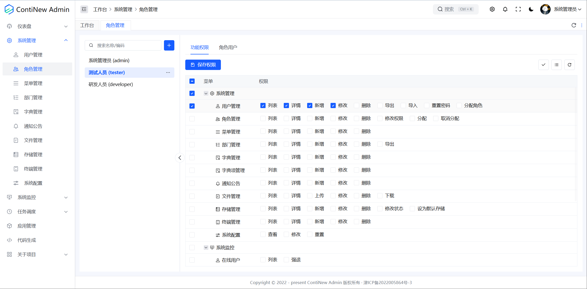
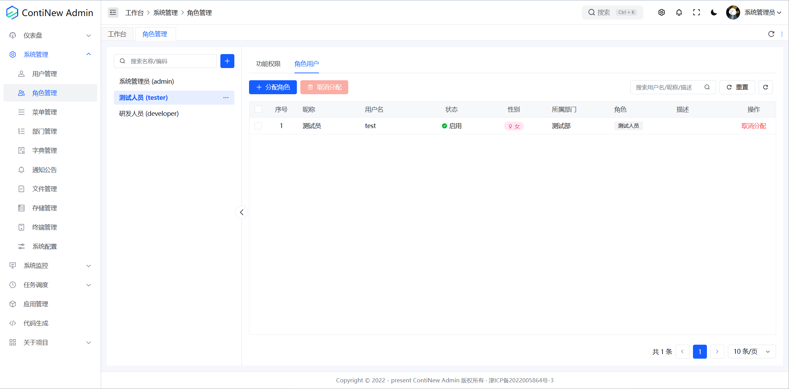
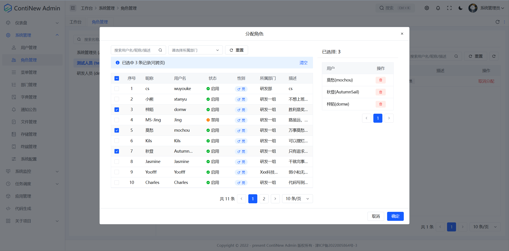
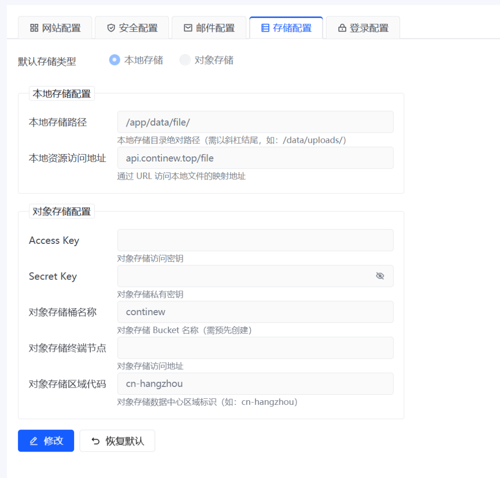
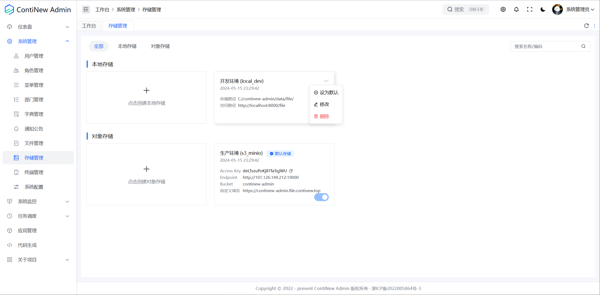
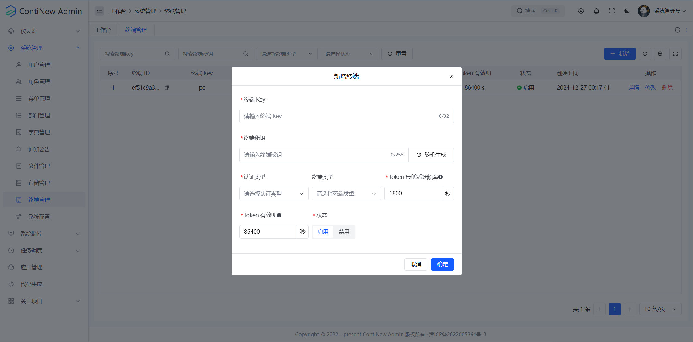
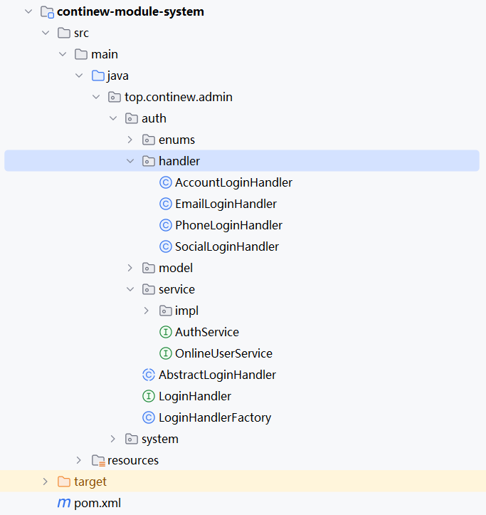
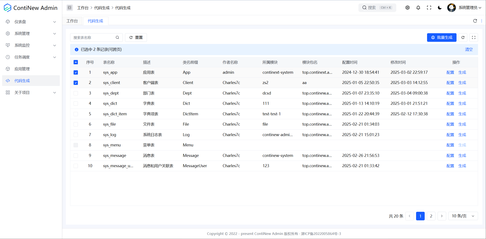
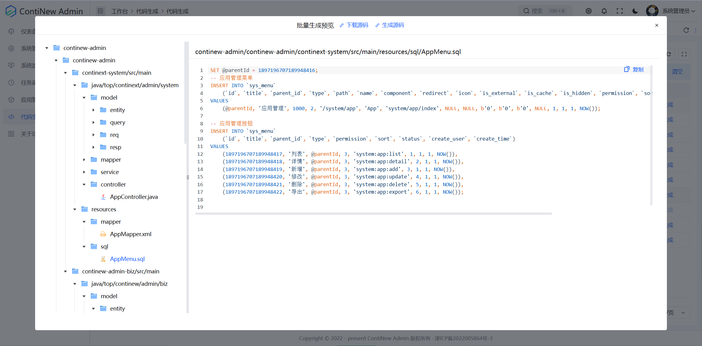

# ContiNew Admin v3.5.0 | 角色管理全面升级

期待已久的 ContiNew Admin v3.5.0 终于发布啦！近期后台收到不少同学咨询新版本的发布时间，感谢大家的耐心等待与长期支持。从立项之初，ContiNew 系列项目就秉持着持续迭代与重构的理念，ContiNew Admin 则着重致力于打造通用性强、设计友好且闭环的中后台解决方案，力求实现开箱即用，让开发更“甜”。虽然我们都是利用业余时间进行开发，无法保证稳定的产出节奏，但请大家放心，我们从未停止产品的打磨，也希望大家能继续给予我们不设限的时间，支持与关注。

---

## 重构角色管理，扁平化角色权限

在这一版本中，我们对角色管理进行了深度重构，带来了全新的交互体验，让角色管理更加高效、直观。

**1.全新布局：左树右表，一目了然** 

我们将原有的分页表格调整为左树右表布局，左侧树形结构清晰展示角色列表，右侧表格详细呈现角色权限和关联用户信息，信息获取更加便捷。

为此，我们特别开发了前端 SplitPanel 分割面板组件，它在移动端也有不错的表现，操作流畅，感兴趣的小伙伴可以亲自体验一下。

在此，特别感谢莫愁和秋帆两位大佬的辛勤付出。

**2.权限管理：扁平化升级，清晰直观** 

将角色权限由纯树优化为了树表格，权限扁平化展示，更加清晰直观，授权和取消授权都能快速定位。

**3.关联交互：角色分配，轻松搞定**

角色与用户的关联交互经过重构后，分配和取消分配角色给用户变得更加方便，分配时会自动过滤掉已分配的用户。取消分配和分配动作拆分，可单个或批量取消授权。

## 优化存储管理可操作性

在这一版本开发时，考虑到文件存储引擎在实际生产中，一般是固定配置，不会轻易变动，所以我们最初计划将存储管理取消，改为在系统配置中增加存储配置。存储配置支持配置本地存储或对象存储，仅支持启用其中一个配置，用于满足不同用户对于本地存储或对象存储的需要。

但在实际开发过程中，我们遇到了一些关于存储和加密的挑战，同时也与部分用户在灵活性方面产生了一些分歧。经过综合评估，我们决定暂时专注于重构和优化存储管理的可操作性。

具体来说，我们将原有的分页列表模式调整为无分页卡片模式，这种设计不仅提升了界面的直观性和易用性，还优化了用户体验。此外，我们将“设为默认存储”这一操作从新增和修改环节中解耦，使其成为一个独立的操作选项。这一改变让操作更加灵活，用户可以根据自身需求随时调整默认存储设置，而无需在新增或修改数据时进行额外操作。

## 新增终端管理，重构认证体系代码

近期有用户提出了多客户端的设计需求，恰好我们在后续的版本计划中，有计划增加小程序用户端，而且也一直有计划重构认证体系代码。所以，在这一版本我们推出终端管理预览版，APP端、小程序端、PC端等可根据不同端配置不同 token 时效。目前多端用户是融合在一起的，后续我们将根据需要进行拆分，你也可以根据自己实际情况调整。

借此机会，我们使用策略和工厂重构了登录体系代码，融合了登录接口。

## 代码生成器迭代，批量生成

正如我们在常见问题中提到的，代码生成器并非我们开发的核心重点。我们最初的定位是通过它提升约80%代码的开发效率，剩余部分则需要开发者根据具体需求自行调整。然而，关于代码生成器的需求却源源不断。为了满足大家的期望，我们一直在持续迭代和完善它。

目前，我们已经对代码生成器进行了以下优化和扩展：增加了生成菜单SQL的功能、支持生成Mapper XML文件、扩展了更多类型的表单项支持、实现了批量生成代码的能力，提供了直接生成到本地的选项。

## 其他修复及优化

此版本我们依然优化修复了大量细节，在此特别感谢为之付出努力的维护成员及社区同学。

**前端方面：** 修复图形验证码接口被调用 2 次的问题、验证码过期时间改为对比服务器时间、修复文件无法直接下载问题、新增菜单全局搜索控件，GiForm 同步 gi-demo 更新等。

**后端方面：** 新增接口文档配置，支持显示 SaToken 权限码、完善异常处理器、修复 PageResp 手动分页计算错误、调整 starter 内的通用模型到 admin 项目，starter 内部大量优化更新等。

**版本前瞻：** 在即将到来的v3.6.0版本中，我们将重点聚焦安全优化，虽然可能没有大功能新增，但经过深度完善与优化，系统将更加稳定、可靠，为你带来更安心的企业开发体验，敬请关注！如果你有 Web 系统安全方面的经验，欢迎在交流群或评论区留言讨论。

---

如需查看 v3.5.0 中优化和特性的完整列表，请参阅 [更新日志](https://continew.top/admin/other/changelog.html#v3-5-0-2025-03-05)。
