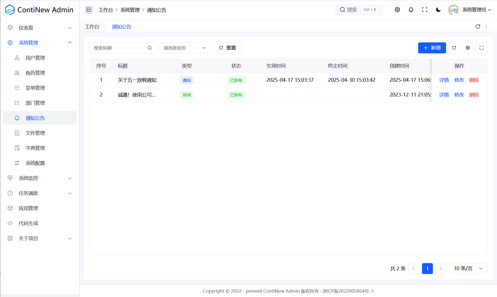
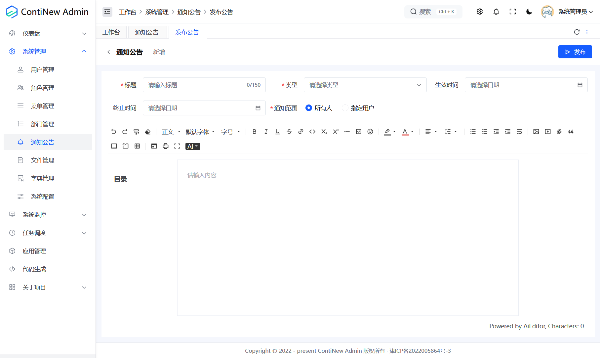
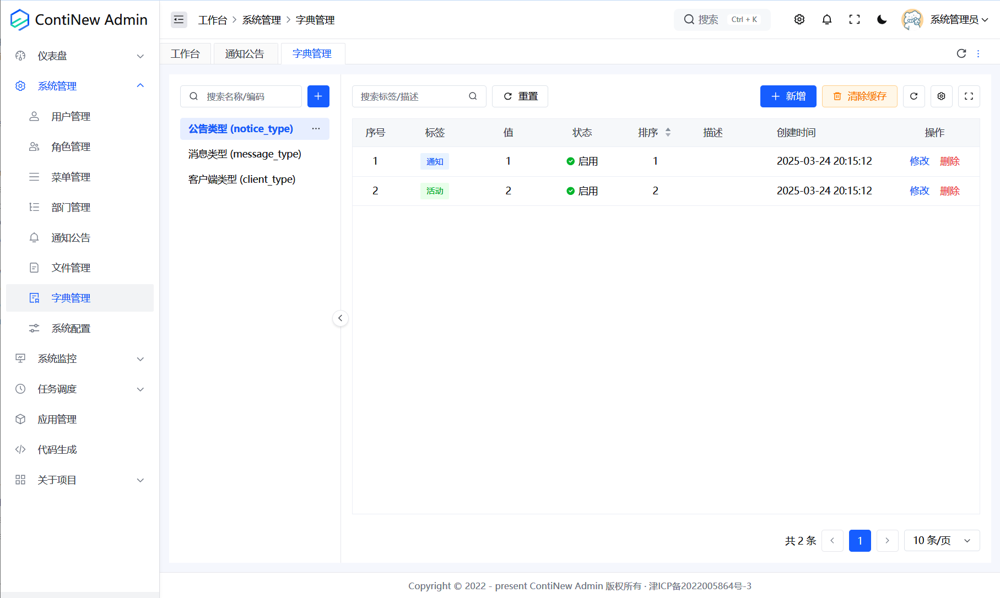
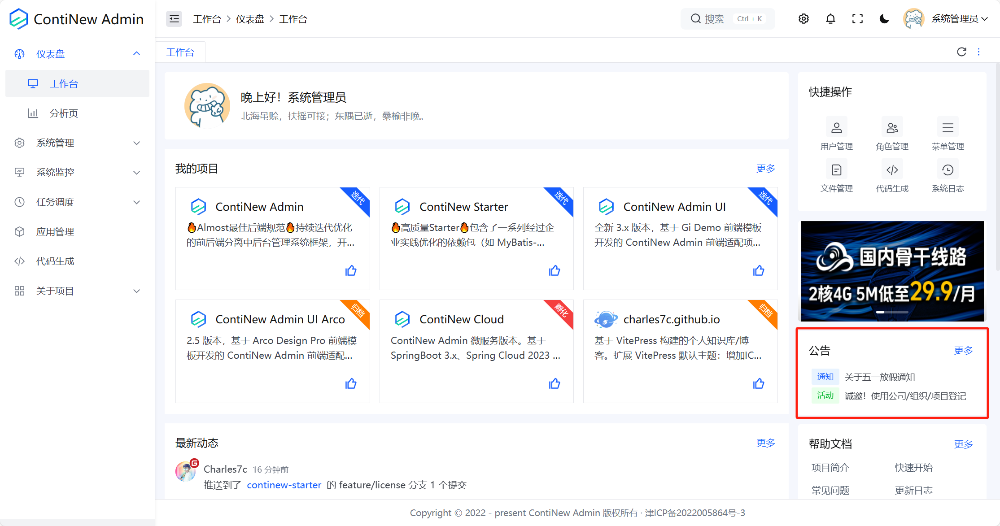
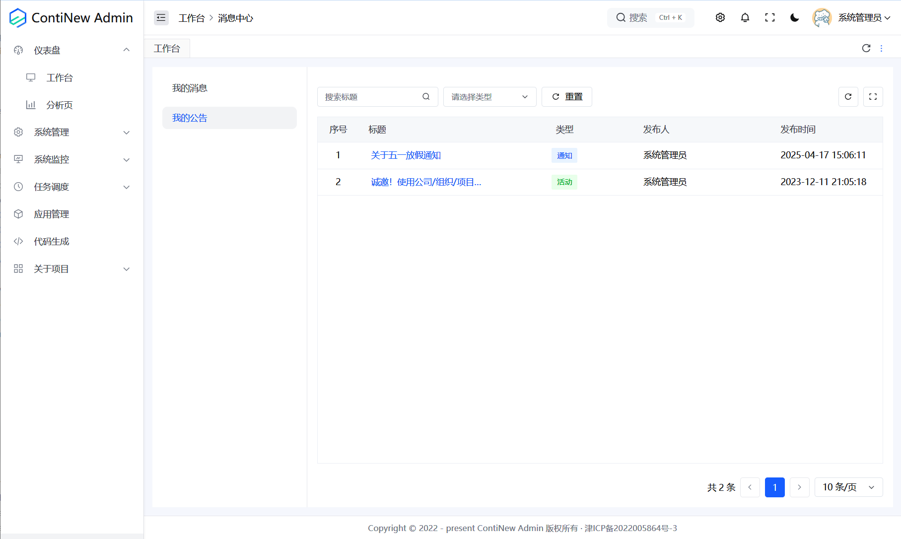
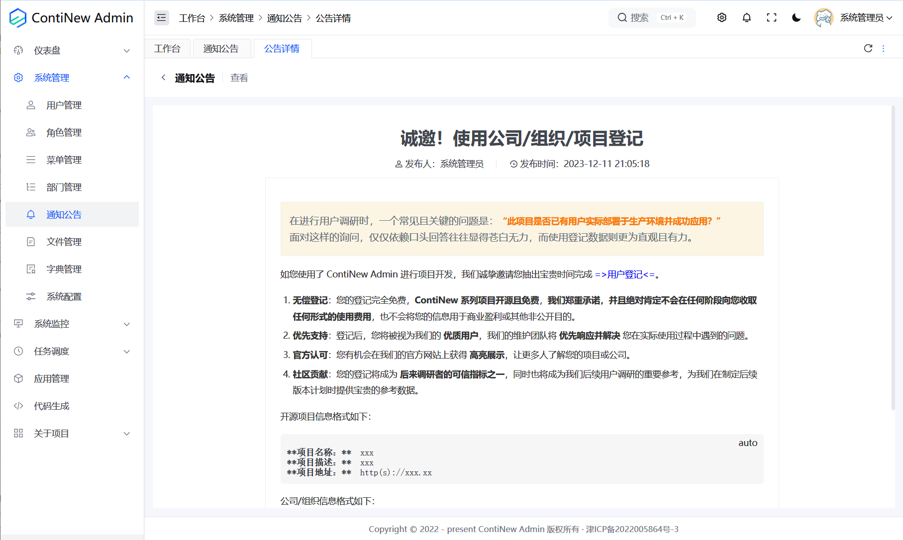
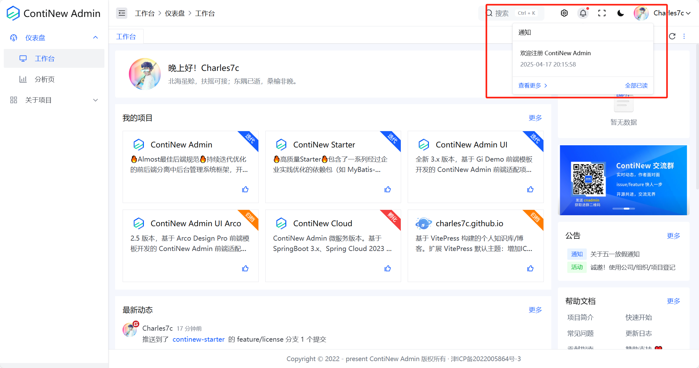
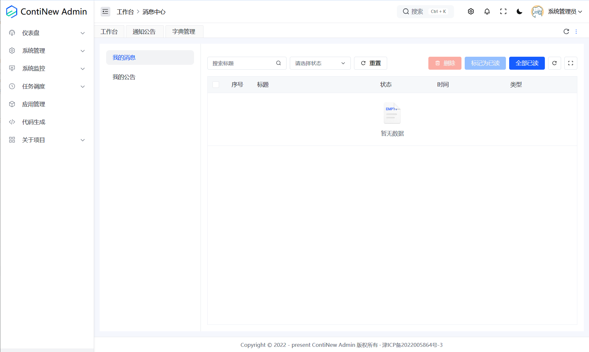

# ContiNew Admin | 头脑风暴！通知公告设计投票

在上一版本（v3.6.0）中，我们完善了个人消息中心，新增了个人公告列表展示功能（之前个人公告仅在首页展示前 5 条）。进入 v3.7.0 版本，我们希望能彻底搞定消息通知入口，并增强通知相关能力，以便后续版本小程序端的顺利接入。目前，我们已收集到部分需求，但仍有一些小细节需要大家提供宝贵意见。请 [阅读原文] 投票，并在评论区留下您的需求。

---

## 之前版本，公告设计简要说明

在之前版本中，公告和消息也是拆分设计的。其中，公告数据存储于 sys_notice 表中。公告管理位于系统管理目录下，被命名为通知公告。这个名字，让很多大佬都产生了误解，这也是我们决定要完善设计的一小方面原因。

公告管理支持富文本编辑，支持设定通知范围，支持生效时间，支持设置公告类型（这里的公告类型是由字典 notice_type 来维护的，我们认为它无关业务仅作分类用，所以使用数据字典来维护，但因为内置字典项示例中有一个通知，让很多大佬误认为这个类型就是通知消息了，这是我的锅，我决定移除掉对应类型）。

管理员新增了公告后，用户可以在两个地方查看公告，最显著的是工作台右侧区域，可以查看最近 5 条公告，点击更多可以跳转到个人消息中心的个人公告页面，这里可以分页查看个人公告列表。 

## 之前版本，消息设计简要说明

在之前版本中，消息数据存储于 sys_message 表中，通过 sys_message_user 表来记录用户阅读状态。消息管理是没有新增入口页面的，唯一的新增场景是在第三方登录后，系统会新增一条安全消息：提醒用户注册成功，及时修改密码，并通过 WebSocket 发送消息到前端系统（详情请查看后端第三方登录处理类）。

用户可以在系统页面上方的小铃铛中查看未读消息（有未读消息时，小铃铛会显示红点），点击查看更多可以跳转到个人消息中心的个人消息页面。

在个人消息页面，可以分页查询已读或未读消息列表，支持删除、标记为已读、全部已读功能。

## 设计融合还是拆分？

公告和消息都属于通知范畴，在很多设计上也非常相似，所以，在一些成熟系统中也有将公告和消息融合在一起的设计：使用同一张表和同一个使用入口，通过通知类型区分是公告还是消息。

在融合还是拆分这方面，我们目前仍然选择的是拆分设计，即拆分表、拆分使用入口，拆分后有很多优势，例如：数据表可以根据各自特点进行索引设计，页面也可以根据各自特点进行设计等等。如果正在阅读的大佬你有不同的意见，欢迎在文章开头处投票及在评论区留下看法。

## 本版本公告、消息目前需求

在当前版本中，我们目前已经收集了一些需求，我们的设计目标是足够通用又不臃肿，也不强关联具体业务。

公告：调整公告菜单名称为 [公告管理]、增加置顶功能、增加草稿状态、增加是否弹窗阅读（登录后弹窗，支持强制阅读）、富文本编辑支持图片上传、支持阅读记录。

消息（页面具体设计待定）：在系统管理下增加 [消息通知] 菜单来用于新增消息、支持草稿状态、支持是否弹窗阅读（随时全局弹窗，支持强制阅读）、支持富文本编辑。

后续，我们的小程序端也会接入消息和公告体系。

如果正在阅读的大佬你有更多的需求，有更好的页面设计，欢迎在评论区留言。
