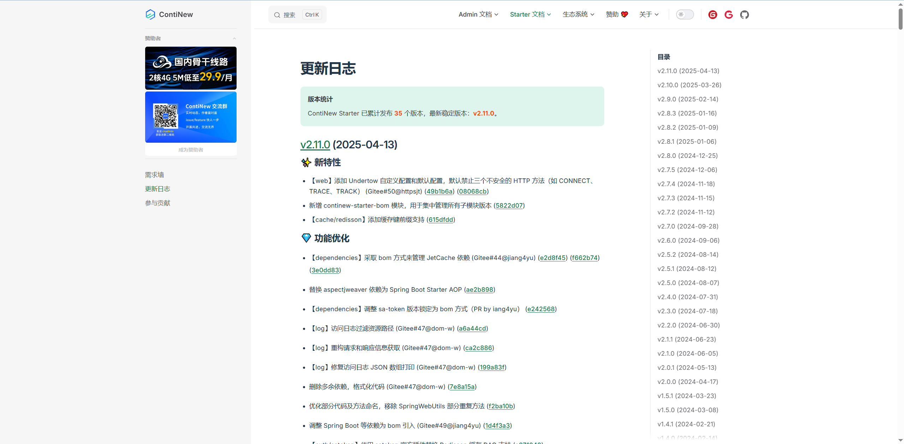
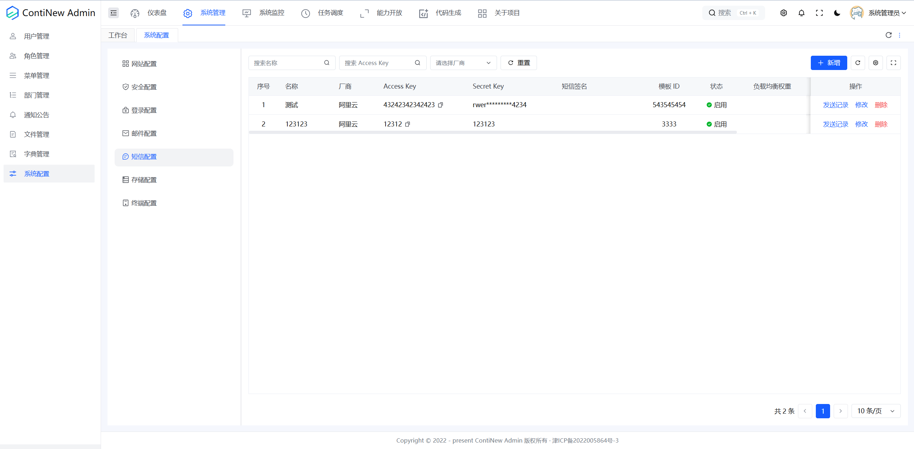
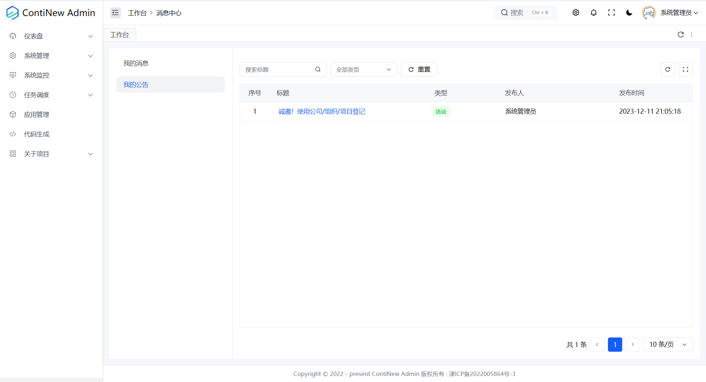
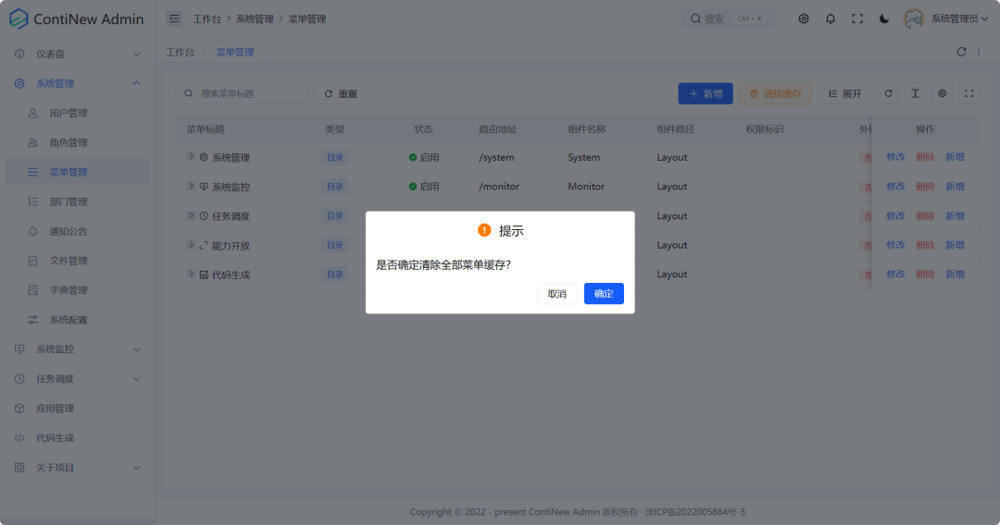
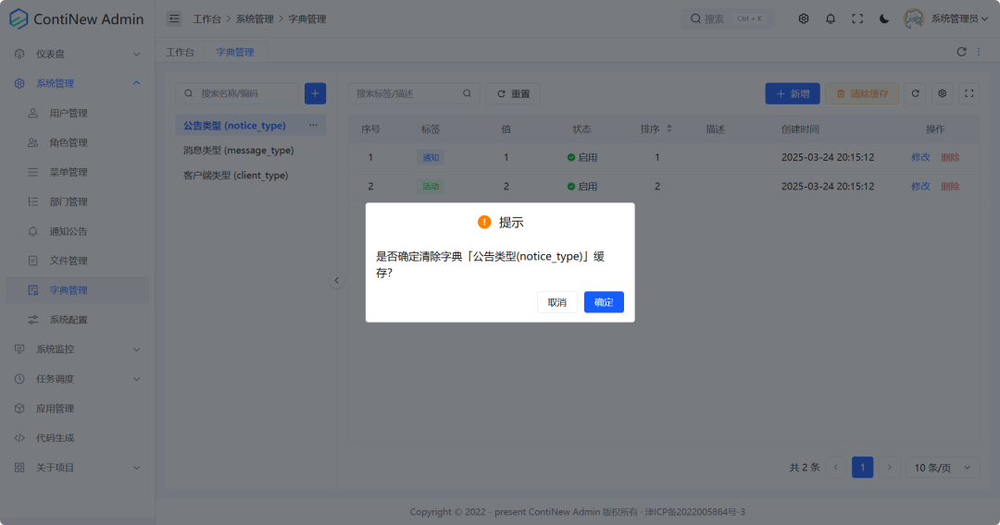
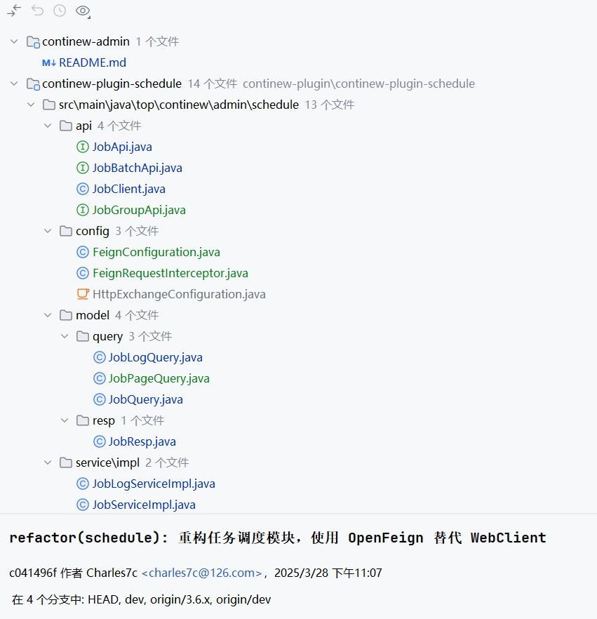
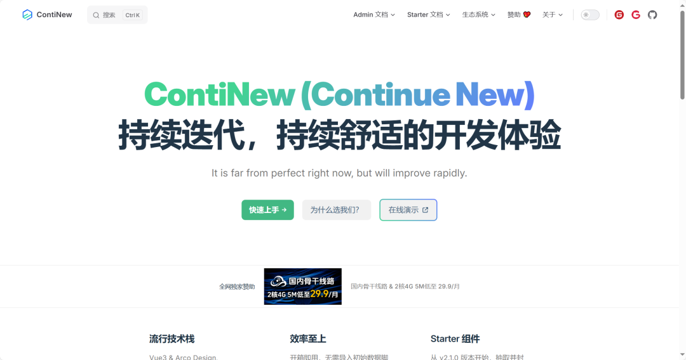
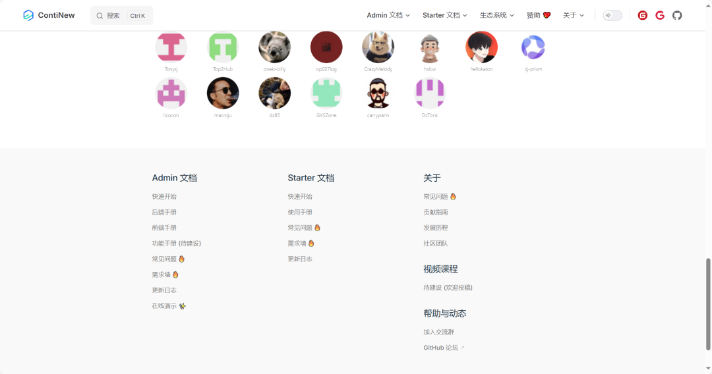

# ContiNew Admin v3.6.0 | 系统配置全面融合

ContiNew Admin v3.6.0 已正式发布！在此版本中，我们全面升级了后端依赖，Spring Boot 升级到了 3.3.9 版本。与此同时，我们也带来了诸多优化，一起来看下吧。

---

## ContiNew Starter 升级到 v2.11.0

作为 ContiNew Admin 的 “肋骨”，后续版本更新介绍都会优先说明下 ContiNew Starter 的更新情况，对后端不感兴趣的同学可直接跳过此部分。

在 ContiNew Admin v3.6.0 版本开发过程中，ContiNew Starter 发布了两个版本，v2.10.0 和 v2.11.0，主要更新内容有：

① 全面升级依赖版本

② 新增幂等模块、新增 XSS 过滤模块、新增链路追踪模块、增加 bom 模块

③ 新增日期类型转换器（不用再为 Query 传参日期类型编写注解转换了）

④ 新增 @Mobile 手机号格式校验注解

⑤ 添加 Undertow 自定义配置等

详细更新请查看 ContiNew Starter 更新日志，其中涉及已使用的优化和特性， ContiNew Admin 已经跟进升级，欢迎查看。

## 新增短信配置，系统配置全面融合

动态配置！动态修改！好吧，我已经着迷于此，懂的人都懂。在此版本中，系统配置又新增了一种动态配置：短信配置，感谢维护团队老罗。通过短信配置，我们可以在不改动配置文件的情况下动态调整短信服务配置，day0 配置也可以交给用户自己去配置了，不要再听什么不会改代码的推脱，没坐！自己配！当然了，如果你的项目不需要动态配置，你可以直接删除相关代码，放开 YAML 配置注释，它依然有效。

随着能力的延伸，系统配置越来越全面，但能力并不集中。前段时间我们还调研了关于系统配置是否拆分模块、拆分菜单的调研，最后我们还是采取了仅调整菜单和页面布局的保守方案。新的系统配置菜单结构、页面布局、完善了每个配置的权限处理，欢迎感兴趣的同学前往体验、升级，也欢迎对此给我们提供更多建议反馈。

## 消息中心：我的公告

在此版本中，我们还调整了消息中心设计，增加了我的公告展示，下个版本我们将重构消息、公告前后端设计，完整闭环消息和公告的能力，欢迎提供建议。

## 菜单、字典新增清除缓存功能

在此版本，我们新增了清除缓存接口，解决了诟病已久的手动清除缓存问题，在数据库改动了菜单和字典数据后，只需要操作一下就可以加载最新配置，希望你会喜欢这个功能。

## 重构任务调度模块，使用 OpenFeign 替代 WebClient

ContiNew Admin 项目的任务调度插件模块 continew-plugin-schedule，目前仅仅是对接了 Snail Job 的接口，并没有做其他深入的开发。仅仅是使得前端拥有了新增任务、查看执行日志的能力，实际上，这个插件模块目前我们有两个设计目的：1.你可以灵活的在你的业务中去调用后端对接的这些任务能力 2.提供一种远程接口调用能力案例，给你参考使用。

原来我们使用的是 WebClient 来调用 Snail Job 的接口，在此版本，我们更换为了老牌“万金油” OpenFeign，使用体验更佳，希望你会理解及喜欢。

## 官网全面升级

在演示站及官网综合 PV 破 11w +（近 30 天统计） 之际，我们全面升级了官网，仍然是基于 vitepress，这次我们使用了 vuejs 官方主题，更大气！优化了文档分类和目录，查看更方便！新增了赞助等级：独家赞助（1名）、铂金赞助（不限）、金牌赞助（不限）、银牌赞助（不限），欢迎大佬们多多支持。

## 其他修复及优化

ContiNew 系列项目致力于持续迭代、持续舒适的开发体验。我们不追逐迅速增加新功能，更重视闭环解决方案、重视重构已有代码、页面设计。此版本我们依然优化修复了大量细节，在此特别感谢为之付出努力的维护成员及社区同学。

**前端方面：** 优化角色权限节点关联及独立切换效果，优化字典项颜色选择功能，使用 GiPageLayout 优化用户、角色、字典管理，为定时任务添加内置 Cron 表达式（优化了用户输入体验，提供了常用的定时任务执行周期模板），修复账号登录记住我不起作用的问题，修复清空最后一页数据后列表空白，分页条消失的问题，修复 PNPM v10 版本打包报错的问题，GiForm、GiTable、GiPageLayout 同步 gi-demo 更新等等。

**后端方面：** 添加字典和菜单缓存清除功能，新增 Excel 字典数据转换器，移除 DateTimeFormat 注解的使用，日期类型统一改为 LocalDateTime，用 @Email 和 @Mobile 注解替换了部分验证，提高了代码可读性，修改了多处错误提示信息，使其更加友好，修复删除用户时未及时清除第三方账号信息的错误，修复文件管理域名未配置斜杠未后缀无法正常显示的问题等等。

**版本前瞻：** 在即将到来的 v3.7.0 版本中，我们将重点聚焦消息和公告的闭环，如无特殊计划，v3.7.0 将是 3.x 最后一个稳定版本，4.x 多租户版本就要来啦！敬请期待！

--- 

如需查看 v3.6.0 中优化和特性的完整列表，请参阅 [更新日志](https://continew.top/admin/other/changelog.html#v3-6-0-2025-04-13)。
