# ContiNew Admin v3.7.0 | 重构通知公告及消息

ContiNew Admin 3.x 大版本的最后一个稳定版 v3.7.0，已正式发布！此版本全面重构了通知公告及消息功能，并对现有模块设计进行了多项优化。快来看看吧！

---

## ContiNew Starter 升级到 v2.12.2

每次更新，我们都要先聊聊 ContiNew Admin 的 “肋骨” ContiNew Starter 的更新情况。对后端不感兴趣的同学，可直接跳过此部分。

在 ContiNew Admin v3.7.0 版本开发期间，ContiNew Starter 发布了 v2.12.0、v2.12.1 和 v2.12.2 三个版本，关键更新包括：

① 全面升级依赖版本

② 新增 License 模块

③ 优化文件工具类下载文件逻辑，减少堆内存占用 (GitHub#12@BruceMaa)

④ Jackson 大数值序列化增加多模式支持 (Gitee#63@httpsjt)

⑤ 新增默认幂等名称生成器

⑥ 修复幂等处理切面，未设置超时时间的问题

⑦ 兼容redis没配置密码时出现redisson实例化失败的问题 (Gitee#54@muxuanya)

⑧ 修复 Excel 导出时无法正确捕捉异常的问题

⑨ 修复默认 Response 类 msg 传递污染的问题

⑩ 修复 application/x-www-form-urlencoded 请求体数据无法在 Controller 层获取的问题

详细更新请查阅 ContiNew Starter 更新日志。其中涉及已使用的优化和特性， ContiNew Admin 已经跟进升级，欢迎查看。

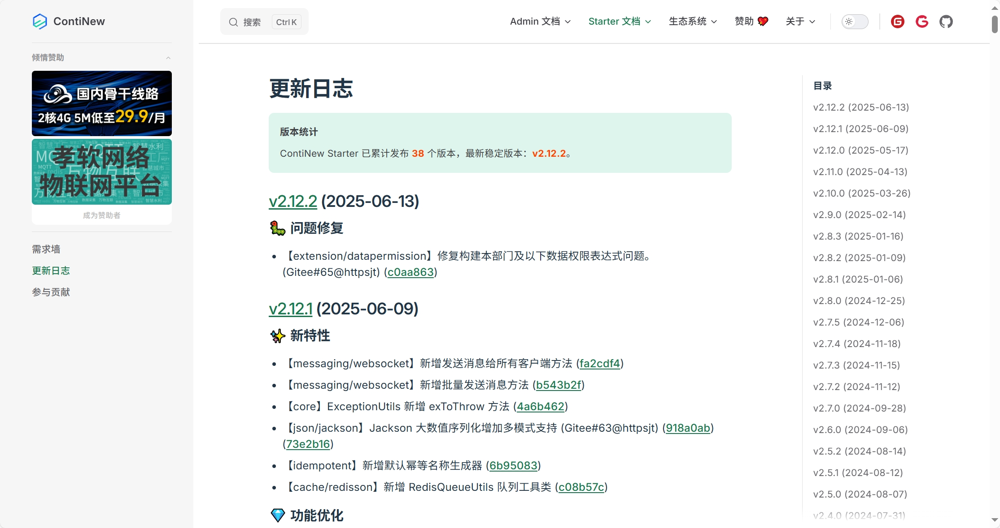

## 重构通知公告及消息

此版本重构了公告和消息设计，包括表设计，重点聚焦消息和公告的闭环。具体更新有：

① 公告支持通知方式：系统消息、登录弹窗

② 公告支持定时发布（目前采用定时任务轮询，后期计划利用 Redisson 延迟队列进行重构）

③ 公告支持首页置顶

④ 公告支持草稿状态

⑤ 调整了公告分类字典

经过第 1 项和第 5 项调整，这回应该不会再有人误解公告和消息了吧？（之前总有人询问，通知公告选了通知分类，为什么顶部消息铃铛里没有通知消息？）

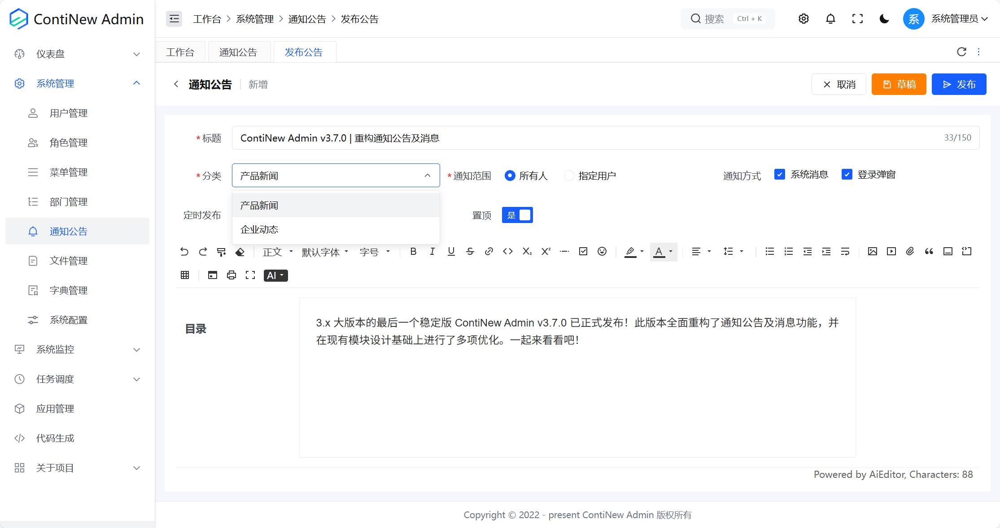

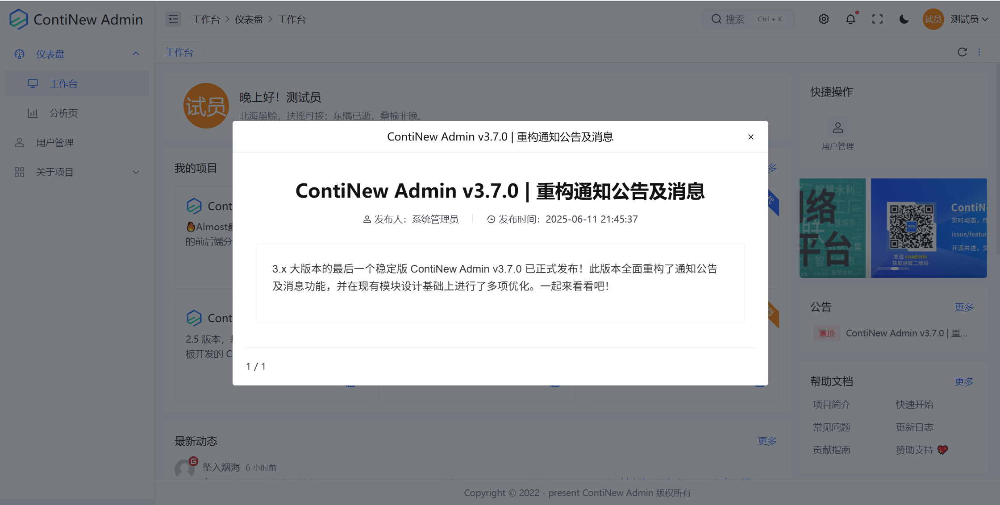

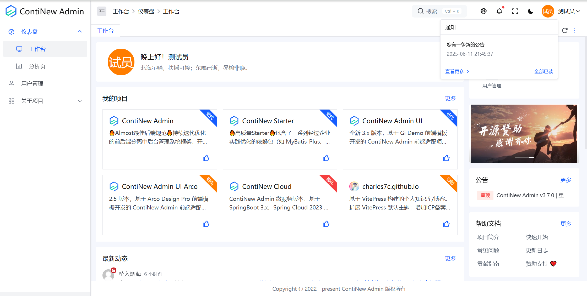

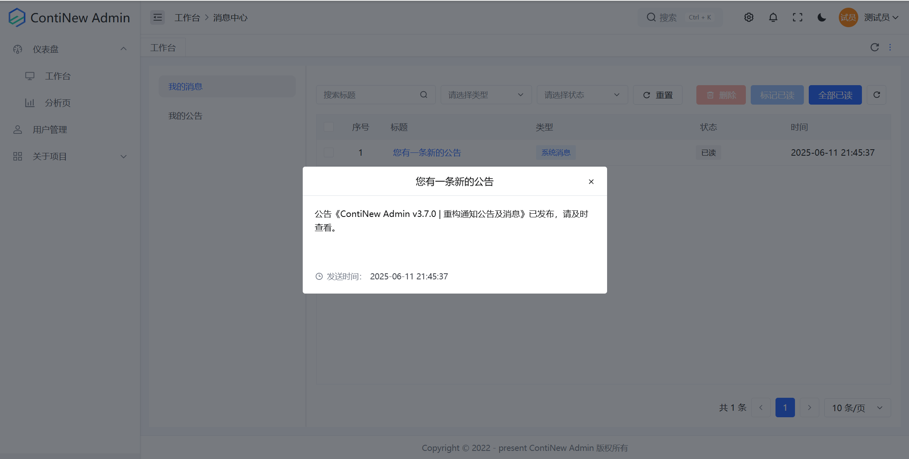

## 文件管理支持文件夹

此外，此版本还调整了文件管理设计，增加了文件夹支持，并对上传文件相关 API 及实现进行了全面优化。

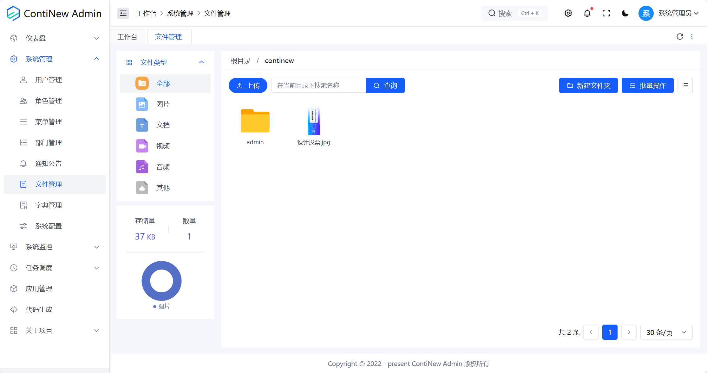

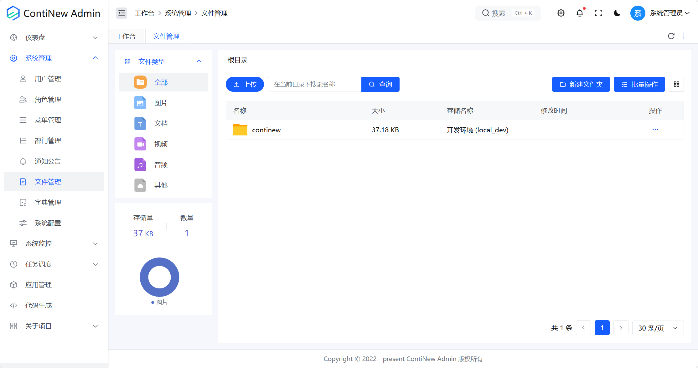

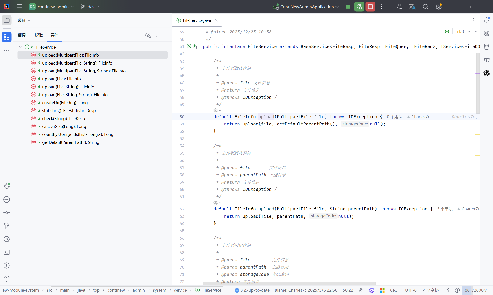

## 项目漏洞修复

在目前的系统中，我们仅对用户管理进行了数据权限控制，但随着项目迭代，部分 API 的使用出现了水平越权漏洞！本版本中，我们针对用户管理中的越权漏洞进行了重点修复！

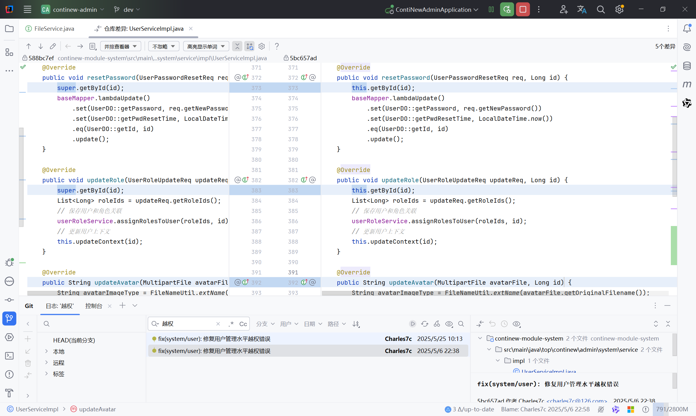

不仅如此，针对文件上传接口我们也增加了文件格式限制，提前消除你使用前的漏洞！

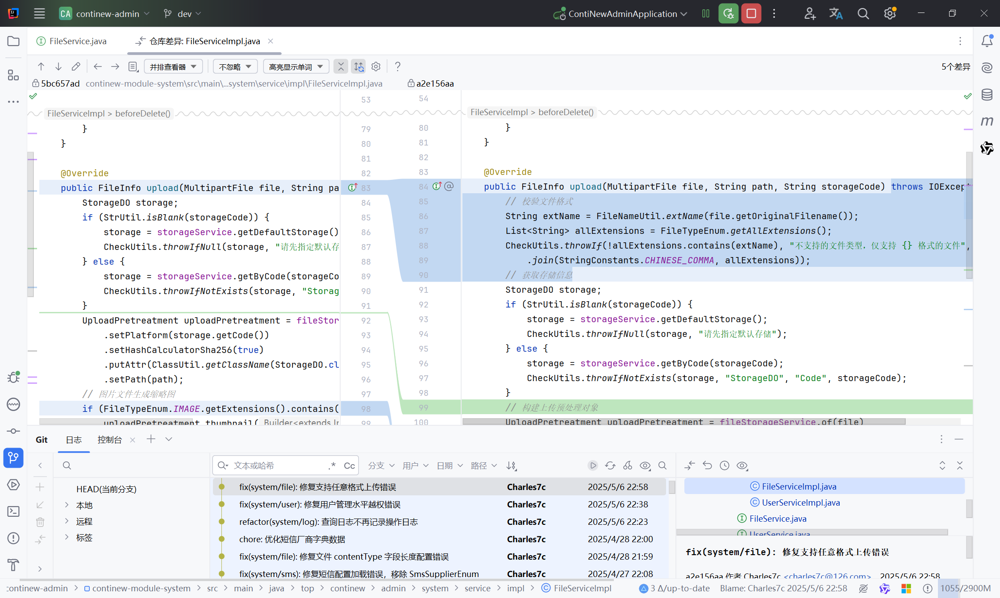

## 临时修复 @CrudRequestMapping 无法通过 @SaIgnore 放行

老用户可能知道，使用了 @CrudRequestMapping 的 Controller，无法通过 @SaIgnore 为默认提供的 CRUD API 放行鉴权和认证。此问题由来已久，维护团队也早就在 SaToken 项目提交了 Issue。时至今日，Q 佬出手了，相信将让你的接口调试更轻松！（4.x 大版本我们将从此问题出发，考虑 CRUD API 重构，例如：增加 Api.CREATE、Api.CREATE_PERMISSION 枚举；@CrudRequestMapping 增加鉴权相关属性，如果你有好的优雅的建议，欢迎一起聊一聊）

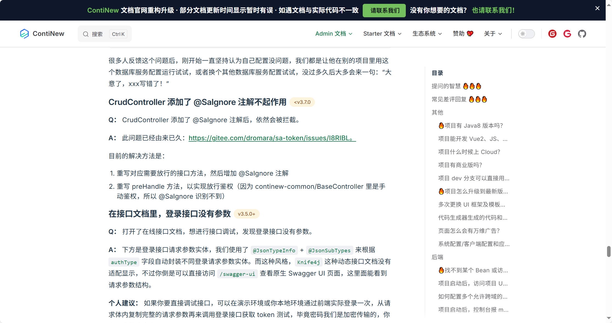

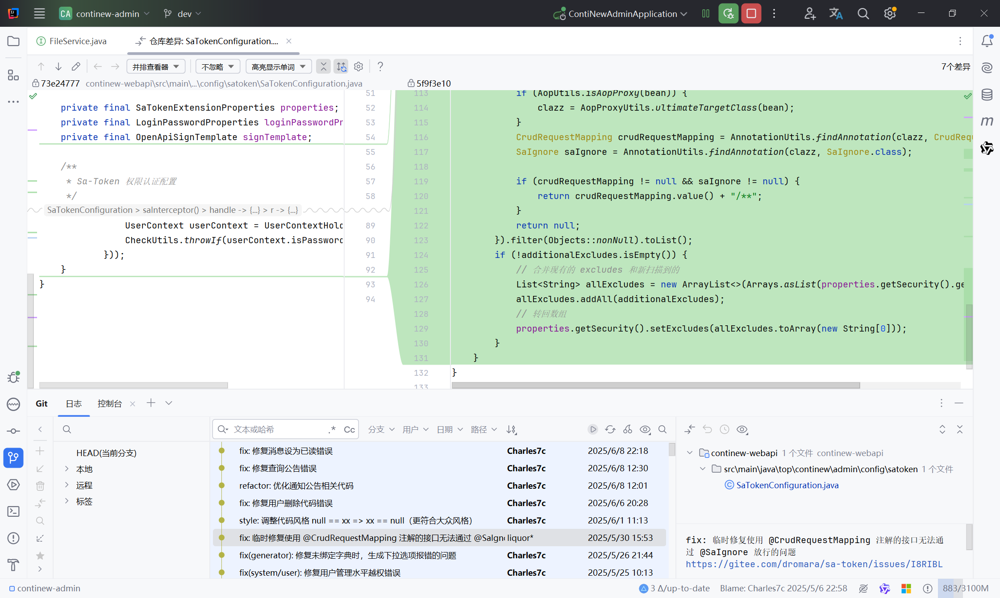

## 其他修复及优化

ContiNew 系列项目致力于持续迭代、持续舒适的开发体验。我们不追求迅速增加新功能，更重视闭环解决方案和代码、页面重构。此版本我们依然优化修复了大量细节，在此特别感谢为之付出努力的维护成员及社区同学。

**前端方面：** 修复消息中心已读计数更新问题，修复GiForm中DateRangePicker无法正确赋值，修复字典项如果不选择颜色，就不会显示标签的问题，修复文件批量删除接口传参错误等等。

**后端方面：** 优化完善全局异常处理器，角色表是否父子节点关联字段调整默认值为 true，修复 BCryptEncryptor 在部分场景会导致重复加密的错误，修复未绑定字典时，生成下拉选项报错的问题等等。

**版本前瞻：** v3.7.0 是 3.x 最后一个稳定版本，下一版本将是 4.x 多租户大版本，敬请期待吧！友情提示：大版本变动较大，老项目不建议跟进升级！

---

如需查看 v3.7.0 中优化和特性的完整列表，请参阅 [更新日志](https://continew.top/admin/other/changelog.html#v3-7-0-2025-06-13)。
