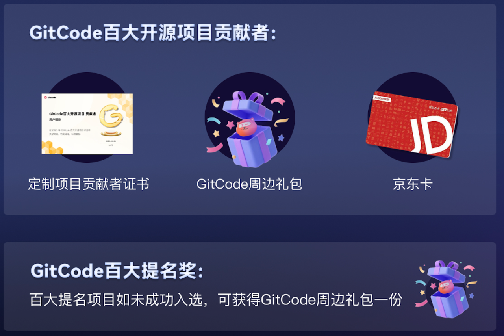
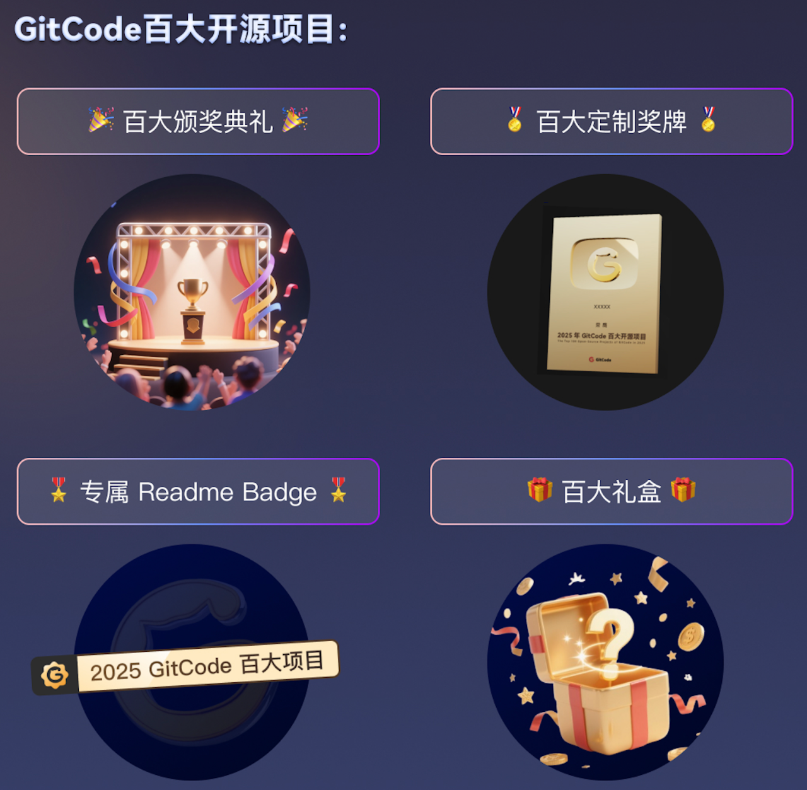
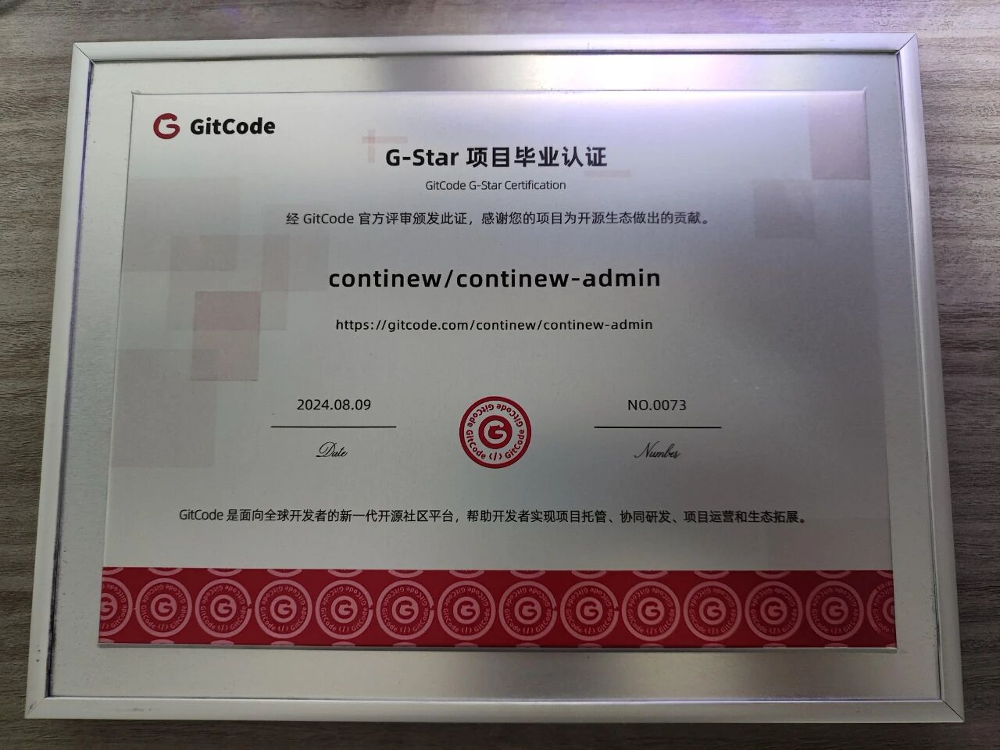
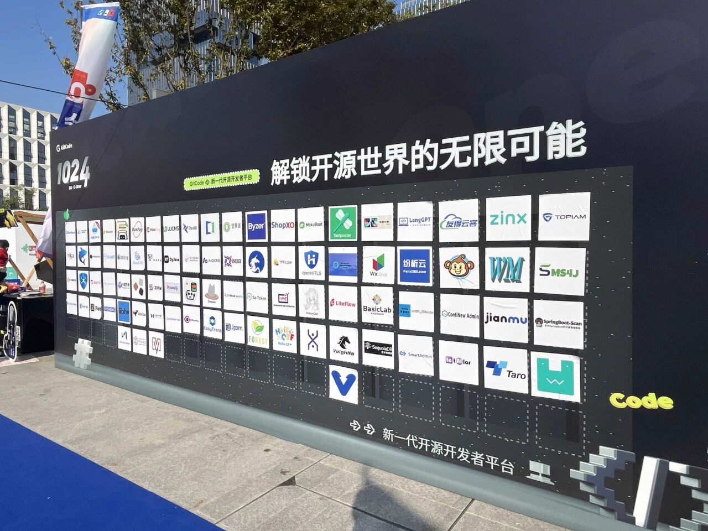
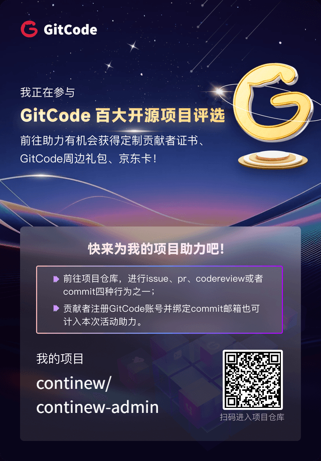

# GitCode 百大开源评选！助力 ContiNew Admin 上榜，赢证书+京东卡+限量周边！

从 6月30日 起，GitCode 推出了百大开源项目评选活动，我们诚挚的希望，一直支持我们的家人们能助力 ContiNew Admin 项目上榜！一起来赢证书+京东卡+限量周边！

---

## GitCode 百大开源项目评选活动

自2024年6月13日GitCode G-Star计划正式发布以来，已有610个开源项目踊跃加入，其中 316个项目凭优秀的代码质量、完善的社区运作模式，成功通过G-Star毕业认证。同时，还有 294 个国内开源项目正处于孵化中，它们在 G-Star 计划的精心培育下，正逐步壮大，展现出强大的发展潜力和广阔的市场前景。

GitCode百大计划旨在表彰GitCode平台上积极推动项目社区化，拥有广泛影响力的G-Star项目，入选项目不仅代表了GitCode开源生态的蓬勃发展，也反映了当下开源行业的发展趋势。

## GitCode 百大开源项目评选活动规则

1.GitCode百大项目指**在GitCode平台获得社区化贡献者数量前100名的G-Star项目**（百大认证有效时间：1年，次年重新进行评选）；

2.社区化贡献行为：用户在GitCode平台为G-Star项目进行提交 issue、提交 PR（Pull Request）、提交 CR（Code Review）、绑定 commit 邮箱（需要有历史提交）任一行为。

3.百大项目贡献者权益：百大项目评选期间，前10个在GitCode合并成功pr的贡献者可获得平台发出的贡献者证书（电子）+成长礼包（周边），一人仅可获得一次；前10个在GitCode提出的有效issue可获得10元京东卡，一人仅可获得一次。

特别提示，为鼓励更多元化的项目参与并确保奖项覆盖更广泛的组织，本次活动特设定规则：**同一组织最多可有5个项目入选百大项目，以促进公平竞争**，让更多来自不同组织的优秀项目获得认可。

## GitCode 百大开源项目评选活动奖品

## ContiNew 与 GitCode

自 GitCode 平台 G-Star 计划启动以来，ContiNew 系列项目便率先入驻，并顺利获得 G-Star 的项目毕业认证，感谢 GitCode 社区工作人员的支持。

团队成员小登（莫愁）去年还曾前往线下参加 G-Star 嘉年华。作为“新项目”，我们也见证了 GitCode 这个“新平台”的成长与努力。GitCode 平台的整体体验不错，反馈通道通畅，活动多也不玩虚的。

这次同一组织限制 5 个项目入选，避免了头部组织“屠榜”。为了更好的参与活动，希望各位家人能点击[阅读原文]或扫描下方二维码进入项目地址，并注册自己的 GitCode 账号参与活动。你的 Issue、PR 都将是我们的助力！我们将第一时间进行回复！之前在其他平台参与过 PR 的家人们只要使用同一邮箱注册账号，更是直接可以计入本次活动助力！！！

