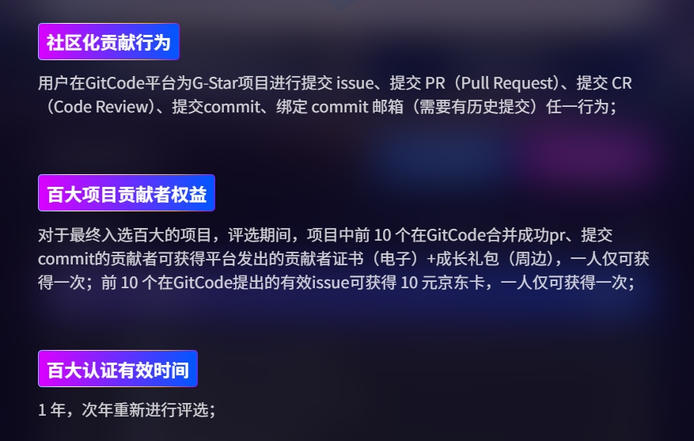

# ContiNew Admin | 头脑风暴！项目模块结构设计投票

在 ContiNew Admin v4.0.0 版本（新增多租户）发布之前，有一个关于“后端项目模块结构设计”的调研投票，希望各位大佬在文章末尾投出你宝贵的一票，你的选择将直接影响 ContiNew Admin 后端项目未来的模块设计风格。

---

## 起因

ContiNew Admin （下文中简称为 cnadmin）是一个 **持续迭代优化** 的，**前后端分离** 的，**[多租户]** 中后台管理系统框架。开箱即用，重视每一处代码规范，重视每一种解决方案细节，持续提供舒适的前、后端开发和产品体验。

由于 Creator 是一名后端开发工程师，所以项目后端一直是本项目重点迭代优化的部分。目前 cnadmin 项目后端采用 **单体多模块** 设计，围绕业务进行模块的拆分，追求 **“高内聚、低耦合”** 两大设计原则（后续将对租户等模块进行插件化改造，支持页面一键安装、卸载），追求 **“一套代码，两套架构”** 的设计目标（后续将提供 continew-cloud 或直接支持快速升级为微服务架构）。

目前的后端项目模块结构设计如下：

```
continew-admin
├─ continew-server（打包部署模块）
├─ continew-system（系统管理模块，存放系统管理相关业务功能，例如：部门管理、角色管理、用户管理等）
├─ continew-plugin（插件模块，存放租户、能力开放等扩展模块，后续会进行插件化改造）
│  ├─ continew-plugin-open（能力开放插件模块）
│  ├─ continew-plugin-tenant（租户插件模块）
│  ├─ continew-plugin-schedule（任务调度插件模块）
│  └─ continew-plugin-generator（代码生成器插件模块）
├─ continew-common（公共模块，存放公共工具类，公共配置、公共 API 等）
└─ continew-extension（扩展模块）
```

在我们目前的设计中，system 模块作为“业务基座”，如果你开发了一个新的业务模块，需要使用到 system 模块中的字典、参数配置等时，可以直接在 dependency 依赖中添加 system 模块。（一般来说，system 模块内容是大概率被依赖的）

当你开发了多个新业务模块，它们之间互有依赖，如果强行在 dependency 中互加，会导致模块循环依赖。此时可以在 common 模块中定义公共 API，在各自业务模块中进行 API 实现（基于 Spring IoC 能力），这样就可以避免模块循环依赖问题。当然了，你可以都采用后面这种方案。

这次 v4.0.0 多租户开发过程中，我们又遇到了模块循环依赖的问题，tenant 模块需要用到 system 模块中的用户、菜单等服务，而 system 模块又需要引入 tenant 的统一数据处理等接口。值此时机，维护团队决定优化下目前已有模块设计，更利于后续模块增加和实际项目模块开发。

为此，维护团队调研当前行业主流框架模块设计，结合企业开发场景， 经过团队初步讨论，现提出五种后端模块设计方案供社区投票，希望各位大佬投出你宝贵的一票，你的选择将直接影响后端项目未来的模块设计风格。

## 方案一：延续现有风格

维持当前结构不变，通过 common 模块定义公共 API，各业务模块直接依赖。模块间通过 Spring IoC 进行解耦，避免循环依赖。

注意：即使保持现有风格，我们也会对相应的包结构等进行优化。

```
continew-admin
├─ continew-server
├─ continew-system
├─ continew-plugin
│  ├─ continew-plugin-open
│  ├─ continew-plugin-tenant
│  ├─ continew-plugin-schedule
│  └─ continew-plugin-generator
├─ continew-common
└─ continew-extension
```

## 方案二：固定拆分为 API + BIZ

每个业务模块严格按照 API 层和 BIZ 层拆分，公共 API 定义与业务实现完全分离。模块数量会暴涨，且大多数开发场景中，主要在 biz 模块内编写代码。

```
continew-admin
├─ continew-server
├─ continew-system
│  ├─ continew-system-api（系统管理模块公共 API 接口、DTO、枚举等）
│  └─ continew-system-biz（系统管理模块业务实现）
├─ continew-plugin
│  ├─ continew-plugin-open
│  │  ├─ continew-plugin-open-api
│  │  └─ continew-plugin-open-biz
│  ├─ continew-plugin-tenant
│  │  ├─ continew-plugin-tenant-api
│  │  └─ continew-plugin-tenant-biz
│  ├─ continew-plugin-schedule
│  │  ├─ continew-plugin-schedule-api
│  │  └─ continew-plugin-schedule-biz
│  └─ continew-plugin-generator
│     ├─ continew-plugin-generator-api
│     └─ continew-plugin-generator-biz
├─ continew-common
└─ continew-extension
```

## 方案三：全局分组 API + BIZ

所有 api 放一起，所有 biz 放一起。

```
continew-admin
├─ continew-server（打包部署模块）
├─ continew-api（全局公共 API 定义模块）
│  ├─ continew-system-api
│  └─ continew-plugin-api
│     ├─ continew-plugin-open-api
│     ├─ continew-plugin-tenant-api
│     ├─ continew-plugin-schedule-api
│     └─ continew-plugin-generator-api
├─ continew-biz（全局业务实现模块）
│  ├─ continew-system-biz
│  └─ continew-plugin-biz
│     ├─ continew-plugin-open-biz
│     ├─ continew-plugin-tenant-biz
│     ├─ continew-plugin-schedule-biz
│     └─ continew-plugin-generator-biz
├─ continew-common
└─ continew-extension
```

## 方案四：平行扩展模块

基于现有结构，按需为特定模块在同级添加对应的 API 模块，保持核心业务模块的完整性，灵活扩展接口层。

```
continew-admin
├─ continew-server
├─ continew-system
├─ continew-system-api（系统管理模块公共 API 接口、DTO、枚举等）
├─ continew-plugin
│  ├─ continew-plugin-open
│  ├─ continew-plugin-tenant
│  ├─ continew-plugin-tenant-api（租户模块公共 API 接口、DTO、枚举等）
│  ├─ continew-plugin-schedule
│  └─ continew-plugin-generator
├─ continew-commom
└─ continew-extension
```

## 方案五：混合式分组

设定 api 分组，按需为特定业务模块添加 api 模块，兼容现有模块结构，渐进式演进。

```
continew-admin
├─ continew-server
├─ continew-api（全局公共 API 定义模块）
│  ├─ continew-system-api
│  └─ continew-plugin-api
│     ├─ continew-plugin-open-api
│     └─ continew-plugin-tenant-api
├─ continew-system
├─ continew-plugin
│  ├─ continew-plugin-open
│  ├─ continew-plugin-tenant
│  ├─ continew-plugin-schedule
│  └─ continew-plugin-generator
├─ continew-common
└─ continew-extension
```

cnadmin 项目的迭代，离不开每一位社区用户的真知灼见。您的意见至关重要！请花 **1分钟** 选择您最认可的方案。如果您有更好的方案设计，请在评论区留言。

投票地址：https://mp.weixin.qq.com/s/qcUHNI8cDiAwDErcHxEeJA

## 限时活动

2025年6月30日至9月30日（为期3个月），GitCode 代码托管平台正举办首届“G-Star百大开源项目评选”。我们的项目已成功入围百大提名，只要保持当前排名，我们就能成功入选百大项目。希望各位家人百忙之中 **捧个人场**！

**支持方式如下：** 

1.注册 GitCode 账号。  
2.在 continew-admin 项目下提交 Issue 或 PR。

注意：若您已在其他平台参与过 PR，只需完成第一步后绑定之前的 commit 邮箱，同样视为助力一次。




