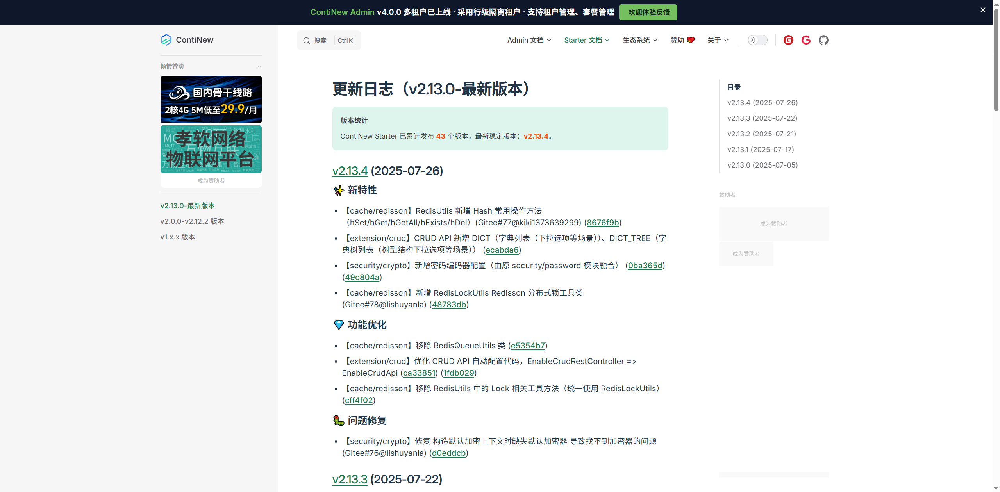
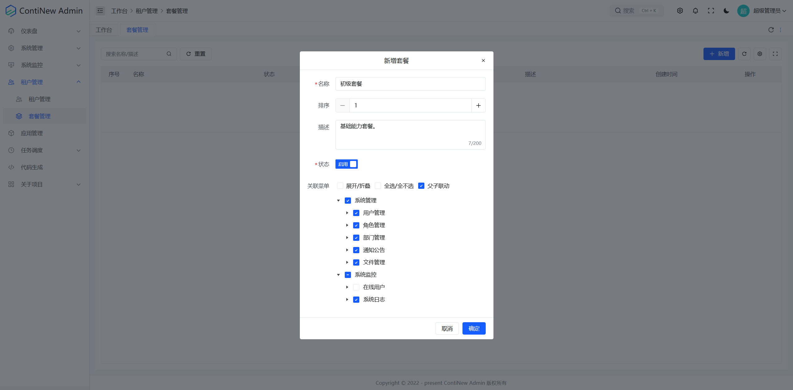
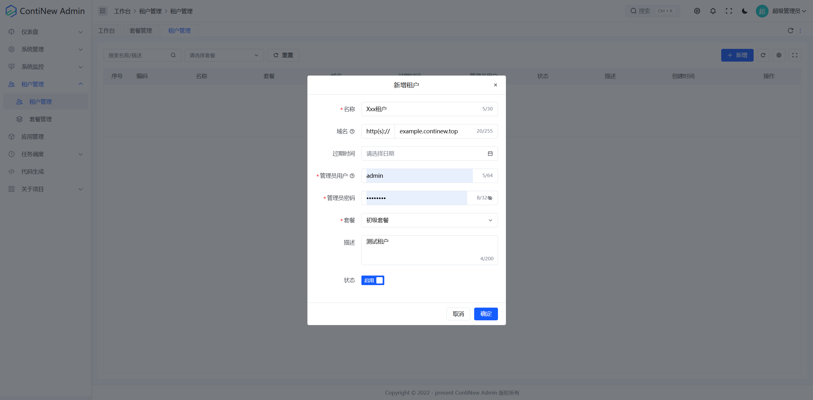
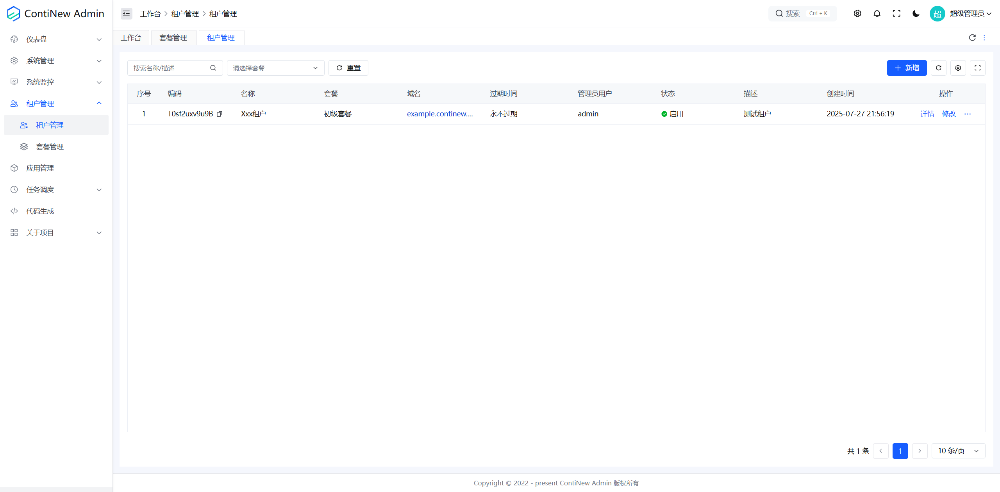
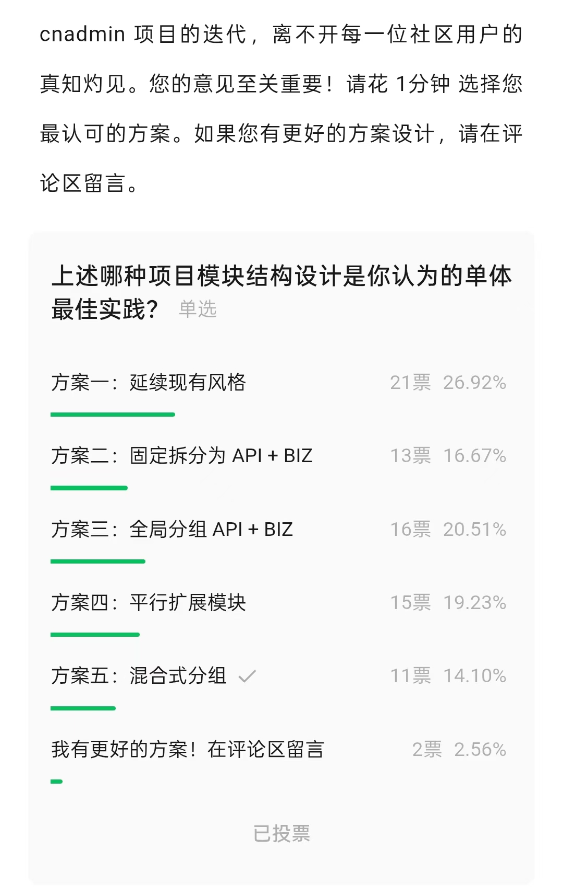

# ContiNew Admin v4.0.0 | 多租户架构正式上线

ContiNew Admin v4.x 系列的首个正式版本 v4.0.0 已正式发布！作为 v3.x 系列的重大升级，本版本重点新增了多租户架构支持，引入了行业主流租户隔离方案，一键开启企业级 SaaS 体验，这个从 v1.x 就被“催更”的功能，现在终于正式上线了。同时，这一版本我们对系统权限、后端 API 设计等核心模块也进行了深度优化，开发体验将更加“甜”。

---


## ContiNew Starter 升级到 v2.13.4

作为 ContiNew Admin 的底层支撑，ContiNew Starter 在本次版本周期内完成了从 v2.13.0 到 v2.13.4 的四次迭代，关键更新包括：

① Spring Boot 升级至 3.3.12 版本  
② 租户组件全面重构，支持行级、数据源级隔离    
③ CRUD API 上新，新增 BATCH_DELETE（批量删除）、DICT（查询字典列表，适合于下拉选项场景）、DICT_TREE（查询字典树，适合于树型结构选择场景）3 项常用 CRUD API   
④ CRUD 树接口重构，支持多根节点树（感谢 @lishuyanla 黎佬）  
⑤ 加/解密模块业务逻辑重构，封装 EncryptHelper 工具类（感谢 @lishuyanla 黎佬）  
⑥ 新增 RedisLockUtils 分布式锁工具类（感谢 @lishuyanla 黎佬）

详细更新请查阅 ContiNew Starter 更新日志。其中涉及已使用的优化和特性，ContiNew Admin 已经跟进升级，欢迎查看。



## 多租户架构支持

本版本核心更新是多租户架构支持，采用行业主流的行级隔离方案，通过业务表增加 `tenant_id` 字段隔离不同租户数据。

> 多租户简介：指同一应用中，为多个客户提供独立的租户环境，数据隔离，互不干扰，常用于 SaaS 应用场景。

通过租户管理、租户套餐模块，可以方便管理不同租户的数据和权限。若当前租户功能不满足需求，请持续关注社区反馈，我们将不断优化多租户生态，欢迎提交 PR 或 Issue。

**友情提示**：老项目若无多租户需求，建议保持 3.7.x 稳定版本；新项目推荐基于 4.x 构建。无需多租户功能，请查阅后端手册《移除/关闭多租户》。





## 系统架构优化

为提升中大型应用场景的可维护性，本版本对系统架构进行了多项调整：

**模块重命名及聚合：** continew-webapi 重命名为 continew-server，continew-module-system 重命名为 continew-system，API 文档、Controller 迁移至各自模块，项目结构更聚合。

**内部 API 解耦：** 根据公众号统一投票决定，我们暂时采用「接口定义-实现分离」模式，在 common 模块定义通用 API，各业务模块提供具体实现，降低模块间耦合度。（实际上我个人看好第 3 和第 5，考虑到升级成本，暂时采用的第 1 种方案）



**优化前：** 

```
continew-admin
├─ continew-webapi
│  └─ src/main/java/top/continew/admin
│    └─ controller # 所有模块的 Controller 接口
├─ continew-module-system
├─ continew-plugin
│  ├─ continew-plugin-open
│  ├─ continew-plugin-tenant
│  ├─ continew-plugin-schedule
│  └─ continew-plugin-generator
├─ continew-common
│  └─ src/main/java/top/continew/admin/common
│    └─ service # 全局通用 Service 接口定义（主要以引入对应模块来获取能力，例如：引入 continew-system 模块依赖来获取用户等业务能力）
└─ continew-extension
```

**优化后：** 

```
continew-admin
├─ continew-server
├─ continew-system
│  └─ src/main/java/top/continew/admin/system
│    ├─ api # 系统管理模块 API 接口实现
│    └─ controller # 系统管理模块 Controller 接口
├─ continew-plugin
│  ├─ continew-plugin-open
│  ├─ continew-plugin-tenant
│  ├─ continew-plugin-schedule
│  └─ continew-plugin-generator
├─ continew-common
│  └─ src/main/java/top/continew/admin/common
│    └─ api # 全局通用 API 接口定义
└─ continew-extension
```

## 更优雅的基础参数校验

本版本引入了 SpEL Validator 组件，它通过为 validator 扩展 SpEL 表达式，在 Controller 层实现了更简洁的参数校验。以往，复杂的基础参数校验需要重写 CRUD Service 方法，而现在，这些校验可以直接在请求参数中配置，无需重写方法。

> SpEL Validator 是基于 Spring Expression Language 的参数校验包，也是 jakarta.validation-api 的扩展增强包，用于简化参数校验，它几乎支持所有场景下的参数校验。
> 设计的初衷是为了解决一些需要判断另一个字段的值来决定当前字段是否校验的场景。

**原来的代码：** 
```java
@Override
public void beforeCreate(NoticeReq req) {
    // 校验定时发布
    if (Boolean.TRUE.equals(req.getIsTiming())) {
        ValidationUtils.throwIfNull(req.getPublishTime(), "定时发布时间不能为空");
        ValidationUtils.throwIf(req.getPublishTime().isBefore(LocalDateTime.now()), "定时发布时间不能早于当前时间");
    }
    // 略...
}
```

**现在的代码：** 

```java
@Data
@SpelValid
@Schema(description = "公告创建或修改请求参数")
public class NoticeReq implements Serializable {

    @Serial
    private static final long serialVersionUID = 1L;

    /**
     * 是否定时
     */
    @Schema(description = "是否定时", example = "true")
    @NotNull(message = "是否定时不能为空")
    private Boolean isTiming;

    /**
     * 发布时间
     */
    @Schema(description = "发布时间", example = "2023-08-08 00:00:00", type = "string")
    @SpelNotNull(condition = "#this.isTiming == true", message = "定时发布时间不能为空")
    @SpelFuture(condition = "#this.isTiming == true", message = "定时发布时间不能早于当前时间")
    private LocalDateTime publishTime;
    
    // 略...
}
```

## 用户和角色体系梳理

本版本还优化了用户和角色体系。超级管理员角色（super_admin）仅有一个用户（admin），权限不可修改或分配。租户管理员角色（admin）每个租户一个，权限同样不可修改或分配。

**内置角色：** 超级管理员（角色编码：super_admin）、租户管理员（角色编码：admin，创建租户时自动初始化），且内置角色不允许修改权限及分配。

**内置用户：** 超级管理员（用户名：admin）、租户管理员（用户名自定义，创建租户时自动初始化），且内置用户不允许变更角色。

**注意：** 此优化因时间原因测试不充分，如遇问题，请反馈。

## 其他修复及优化

ContiNew 系列项目致力于持续迭代、持续舒适的开发体验。我们不追求迅速增加新功能，更重视闭环解决方案和代码、页面重构。此版本我们依然优化修复了大量细节，在此特别感谢为之付出努力的维护成员及社区同学。
最近 ContiNew  维护团队又扩列啦，全栈工程师且同为代码洁癖的黎佬（@lishuyanla）加入了维护团队，并且迅速带来了多项重构优化，代码质量有目共睹，有问题请多多“叨扰”他。

**前端方面：** 优化登录后的页面重定向逻辑；统一加载图标；优化通知公告相关页面的回退逻辑；修复混合布局下的菜单过多不能滚动的问题；调整水印 z-index，以修复表格全屏或表单弹出时水印无法覆盖的问题；修复字典项权限标识不一致的问题；代码生成预览问题等。

**后端方面：** 优化角色和用户相关查询数据填充；为枚举类型的字段添加自定义 Excel 转换器；为 Mapper 接口增加 Mapper 注解，以消除 IDEA 警告标志（减少小白咨询）；使用 CollUtils 替代部分 Stream 操作，提高代码的可读性，减少代码行数；重构唯一校验代码；修复全部已读无效；修复查询未读公告和消息数据错误；修复查询角色关联用户时，角色信息映射错误问题等。

**版本前瞻：** v4.x 大版本在我们的计划中不会迭代太久，主要会集中在完善多租户功能、优化已有模块等方面。 v5.x 将是我们的全面里程碑版本，它将带来新 UI、新前端模板、更多的新功能、新优化，预计将于今年 10.1 后开始开发，敬请期待吧。

---

如需查看 v4.0.0 中优化和特性的完整列表，请参阅 [更新日志](https://continew.top/admin/changelog/#v4-0-0-2025-07-27)。
