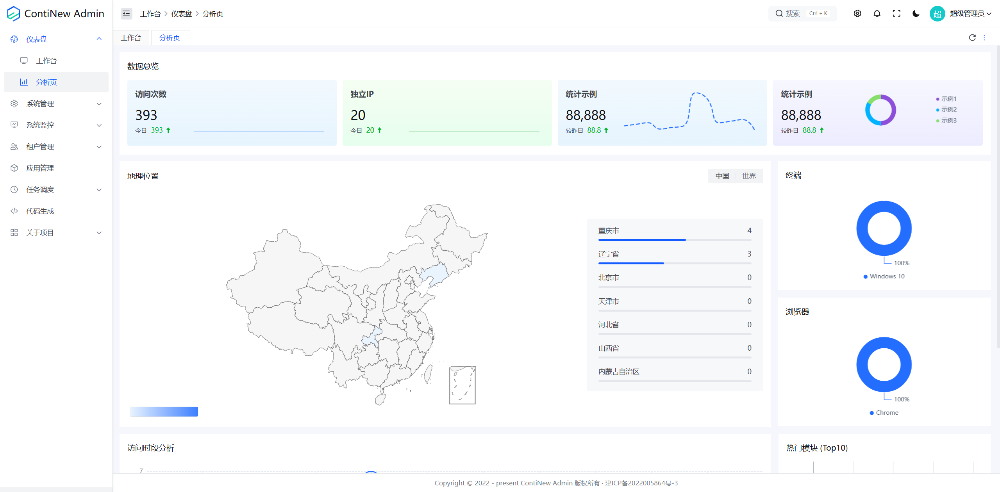
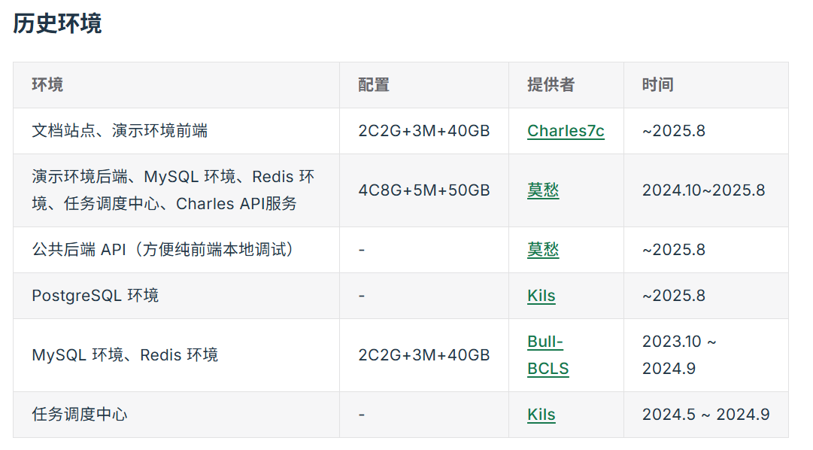
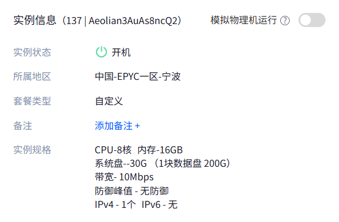
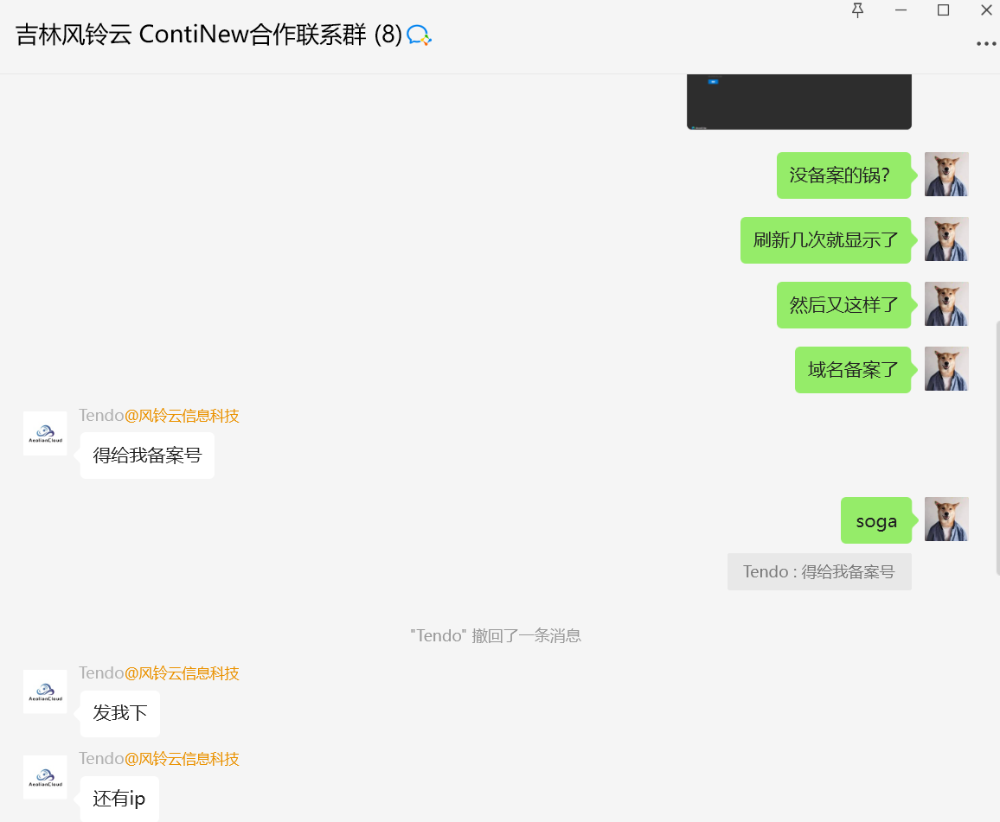
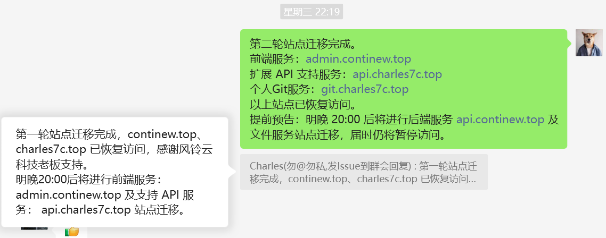

# ContiNew 演示环境已成功迁移至风铃云服务器

经过近一周业余时间的分批部署与迁移，ContiNew 演示环境已顺利迁移至由风铃云（吉林省风铃云信息科技有限公司）支持提供的高性能服务器。这台配备8核CPU、16GB内存与10Mbps带宽的专业服务器，将为社区用户在未来一年内提供更稳定、更流畅的演示体验。

---

## 演示环境的发展历程

在探索有界面的开源项目时，我自己都会优先查看 README 中是否有界面截图，最希望的是能看到有在线 demo 链接。因此，从最开始到现在，虽然有一定困难，但我们一直通过“分布式”方式提供了“简陋”的演示环境。

最初，我提供前、后端项目环境，维护成员阿峰(Yoofff)提供 MySQL、Redis 等基础设施环境，两台阿里云 99 服务器(2核2G3M)支撑起了 cnadmin 项目的首个演示环境。随着项目发展、服务增加以及服务器到期，维护团队的莫愁大佬、Kils 大佬也陆续提供了单个或多个环境支持。再次感谢 ContiNew 开源社区中每一位大佬的支持。

所以，如果你访问时遇到卡顿等场景，请多一些耐心和谅解。我们也在演示环境信息提供页面列了如下注意事项，或许可以解答部分用户的疑惑。

1. 演示环境提供不易，请不要故意破坏线上环境
2. **演示环境每天凌晨 3 点自动执行数据重置任务**，请不要在演示环境添加个人重要数据
3. **演示环境针对修改、删除等操作进行了限制**，如需完整体验请查阅官方文档《快速开始》
4. 演示环境服务器相关配置很低，在访问人数较多等场景可能会比较卡顿（**现在不低了**）
5. **dev 代码提交时会触发 CI/CD 重新部署环境**，部分情况可能会导致服务暂停或集中下线

## 迁移过程与技术保障

莫愁大佬提供的服务器即将在下月下旬到期，风铃云团队大佬得知这一情况后，当晚就给开通了机器。原本4C8G的配置即可满足需求，大佬直接给开了 8C16G，这下子，至少一年内，不用为后续增加的其他服务环境担心服务器问题了，我们也可以基于这点提供更多的演示效果。

在开始迁移时，风铃云大佬迅速响应了迁移支撑群。做乙方久了，只有支持的份，哪有被支持的时候啊。

通常，跨服务商的域名解析变更，少不了要走一套备案流程，动则 3 天起步。没想到这次这么丝滑，几分钟就顺利解析了。

经过三轮有序迁移，ContiNew 相关服务已全部成功部署至新的服务器，这一待办任务也告一段落可以安心更新了，欢迎各位大佬体验最新演示环境，近期会有部分迁移引起的细节更新。

## 关于演示环境服务器：吉林省风铃云信息科技有限公司

吉林省风铃云信息科技有限公司注册于2021年，目前为止已经稳定四年为各中小企，个人，学校科研提供多项上云服务，工信部增值电信许可B1-20212956，线路均接入国内骨干网，与多家T3+机房保持深度合作，全国线路直连平均延迟20ms+，24小时售后。

**对 ContiNew 支持已有半年之久，惠及多位 ContiNew 开发者，受到广泛好评**。以下是针对 ContiNew 用户推出的 AMD EPYC 高性能特价服务器，全系闪存存储阵列，100G 防御独立 IP，全系列设备提供免费备案。

**AMD 三代EPYC Milan：**

- 2H4G 15M 30G+50G  月付29.9 季付77.77 年付299.9

- 4H8G 15M 30G+50G  月付49.8 季付129.9 年付399.9

再次感谢[**吉林省风铃云信息科技有限公司**]对 ContiNew 开源社区的支持，各位大佬如有需要可点击下方链接查看配置详情。

https://www.aeoliancloud.com/cart/goods.htm?id=14
