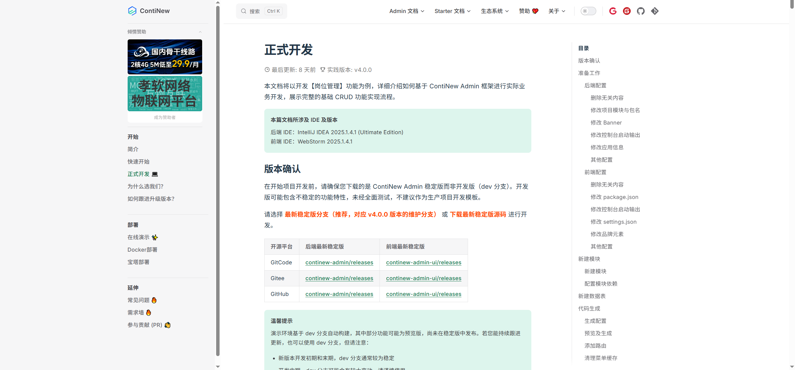
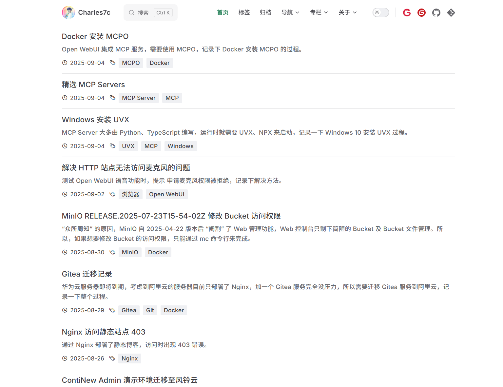
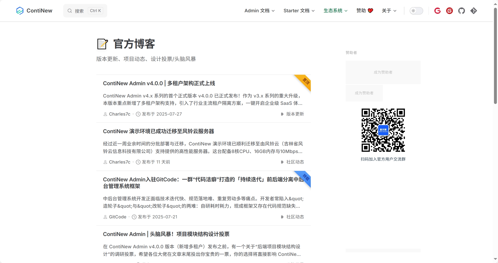
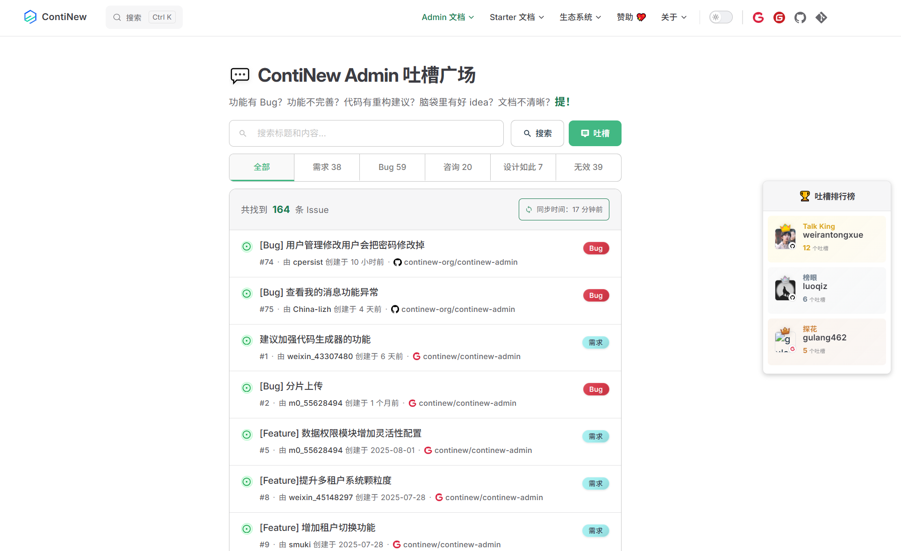
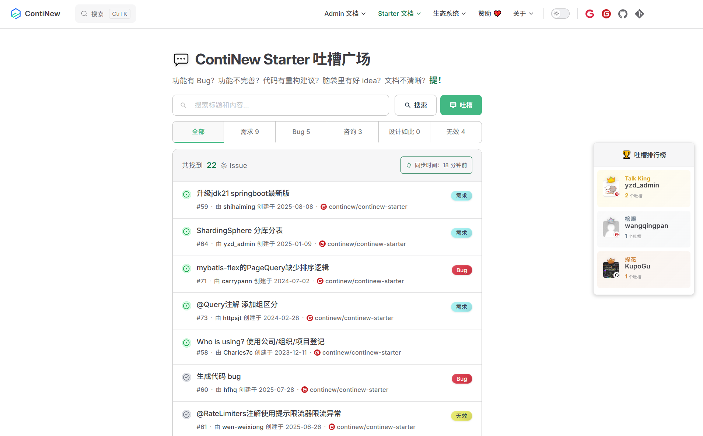

# ContiNew 上线吐槽广场，快来抢 Talk King！

最近，有些小伙伴可能发现，我在群里好久没发项目动态了。确实，我最近进入了一段平静期，梳理了下自己的数据资产，“肝”了很多文档，迁移了 ContiNew 博客，还开发了 ContiNew 吐槽广场。不过，这些工作主要偏重于我个人调整，所以没有每天打扰大家。今天，ContiNew 吐槽广场第一版上线，这一阶段工作收尾，接下来要开启新的阶段了。

---

## “肝”了很多文档

cnadmin v4.0.0 发布之后，我花了好几周的时间，半 AI 半“肝”了许多 Admin 和 Starter 文档。更新历史文档、补充热门文档，虽然还有一部分没完成，但也算告一段落了。我个人觉得，现在的快速开始部分对新用户会有很大帮助。如果你有需要的文档，可以留言告诉我们，我们会根据情况优先补充完善。

除此之外，最近工作环境遇冷，“朝不保夕”，工作任务也偏向了各类调研，还借此机会拾起了 Python，丰富了下自己的知识库。 

## 官方博客上线

之前，ContiNew 相关博客内容都放在我个人的知识库中，这段时间整理的时候，全都迁移到了 ContiNew 官网，也方便后期整体“喂”给 LLM。不喜欢在公众号内阅读的小伙伴儿，后面可以直接在官网阅读部分博客内容。

为了增加博客内容，原来官网文档内容做了一些迁移整理，部分链接已经失效，如果你发现失效的链接，可以提醒我们。

## 官方吐槽广场上线

ContiNew 系列项目自一开始，就在 GitHub 和 Gitee 双平台同步更新。后来随着 GitCode 平台的出现，我们正式扩展为了三平台运营！但由此带来的问题就是我们需要登录 3 个平台查看 Issue 动态，新用户也无法知道自己的需求和 Bug 是不是有人提过。

一些知名的开源项目，通过仅开放某个开源平台 Issue 来统一处理，但我们项目微言轻，在三个平台都想增加下“曝光”，也不想改变你提 Issue 的习惯。为此，我们这次推出了「吐槽广场」，将三个开源平台的 Issue 进行聚合，并按照“需求”、“Bug”等类型分类展示，这下子清爽多了，希望能让你有个不错的开源体验。

当然了，目前仅是第一版，如果你有使用不爽的地方，记得及时告诉我们。也欢迎各位大佬多多“合理吐槽”，抢做 **Talk King**！

## “老登”常谈

这个年纪，核心能力中仍然缺乏“自制力”（也缺“钞”能力），爱吃的非要吃到撑，爱玩的游戏非要玩到困，爱看的小说非要熬夜看，**热爱的工作**和代码久坐憋尿也要一气呵成。不知不觉超重、掉发、视力、痔疮、前列腺，结节竟成了“替罪羊”，这两天还胸闷气短，这下子可没法一气呵成了。昨夜无法躺下入睡差点就跑去挂急诊，最后在线问诊安心后才垫高入睡。

不服岁月是不行的。**不要熬夜，要控制体重，要控制连续工作的时间**，该告一段落就告一段落，给精力和体力、视力一个缓冲。给孩子做榜样的时候，别只会说一句“别学爸爸”。

