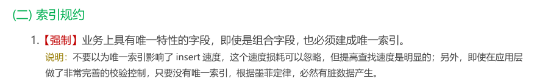
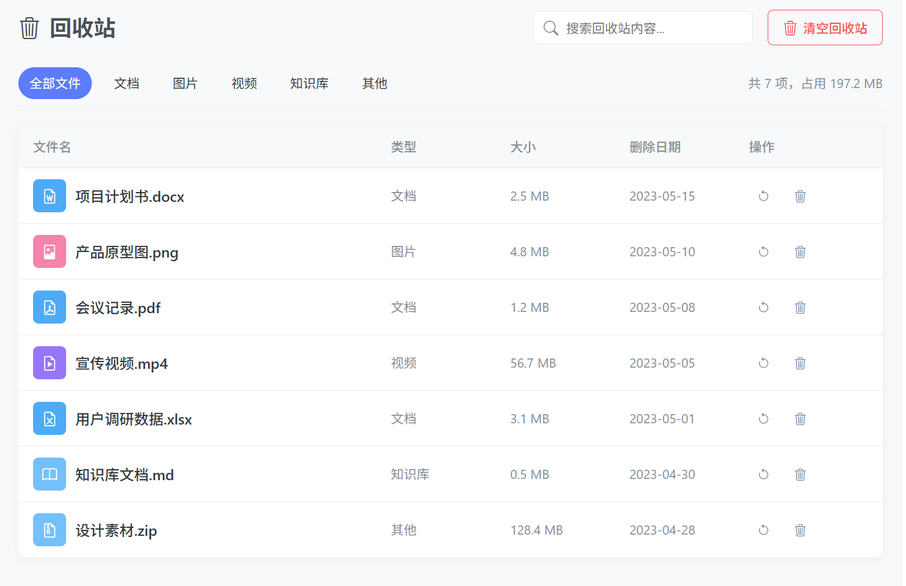

# ContiNew Admin | 头脑风暴！回收站设计投票

在 ContiNew Admin v4.1.0 版本（新增逻辑删除功能）发布之前，有一个关于“回收站相关”的调研投票。cnadmin 的综合愿景是在有限且通用场景内做 almost 最佳方案实践。请各位大佬在文章末尾投出宝贵的一票。

---

## 逻辑删除设计

本版本开始，我们取消物理删除，改为使用逻辑删除。而在设计逻辑删除时，遇到了一个和现有设计冲突的问题：逻辑删除字段和唯一索引。

本想把一直用的 deleted 字段（0：表示未删除；1：表示已删除）直接加过来，突然发现我们开源版本还保留着严格的唯一索引，例如：用户邮箱唯一、手机号唯一。如果不处理的话，就会出现下面的几种场景问题：

**场景1：** 删除了 zhangsan@126.com 用户后，再次添加此邮箱，会出现唯一冲突。

| ID   | 姓名 | 邮箱                 | 是否已删除 |
| ---- | ---- | -------------------- | ---------- |
| 1    | 张三 | **zhangsan@126.com** | 1          |
| 2    | 张三 | **zhangsan@126.com** | 0          |

聪明的你肯定知道，将邮箱和逻辑删除字段一起建立一个唯一索引，但这又会引起第 2 个场景问题。

**场景2：** 删除了 zhangsan@126.com 用户后，重新添加，然后继续删除，又会出现唯一冲突。

| ID   | 姓名 | 邮箱                 | 是否已删除 |
| ---- | ---- | -------------------- | ---------- |
| 1    | 张三 | **zhangsan@126.com** | **1**      |
| 2    | 张三 | **zhangsan@126.com** | **1**      |

聪明的你肯定又知道，那就将 逻辑删除字段 换成存储唯一值，例如：用户 ID、时间戳，没删除的就置为 null，已删除的就存储用户 ID、时间戳。

的确，结合当前使用的 MyBatis Plus 框架，使用时间戳是比较便捷的方案。但它也受限于拥有 NOW() 这一时间函数的数据库。

| ID   | 姓名 | 邮箱                 | 删除时间            |
| ---- | ---- | -------------------- | ------------------- |
| 1    | 张三 | **zhangsan@126.com** | 2025-10-27 10:00:00 |
| 2    | 张三 | **zhangsan@126.com** |                     |

那就还有一种方法，也是我们外包用的比较久的方法：仅在业务层面进行唯一校验，数据库层面去除唯一索引，就像物理外键改逻辑外键类似的思路，这样就可以直接使用最开始说的 deleted 字段了。

但是，selectOne 报错也将成为某种常态...，阿里巴巴 Java 手册-索引规约第一节就强调了此问题。

所以，你有更好的设计吗？请在文章开头，点击 [阅读原文] 为你倾向的方案投上一票。

## 回收站设计

在这一版本，我们还计划做一个回收站的示例：文件回收站。

我的本意是直接用逻辑删除字段，但维护团队内出现了分歧，于是我们初步整理了三种实现方案：

**方案一：基于逻辑删除字段**

①查询回收站数据：查询 逻辑删除字段 为 已删除 的数据

②恢复回收站数据：将要恢复数据的 逻辑删除字段 调整为 未删除 值

③清空回收站：物理删除

**方案二：为指定业务表提供回收站表**

①查询回收站数据：查询指定回收站表的数据

②恢复回收站数据：在业务表重新增加要恢复的数据

③清空回收站：清空回收站表

**方案三：提供通用的回收站表** 

大体同上。

你有更好的设计吗？请在文章开头，点击 [阅读原文] 为你倾向的方案投上一票。
