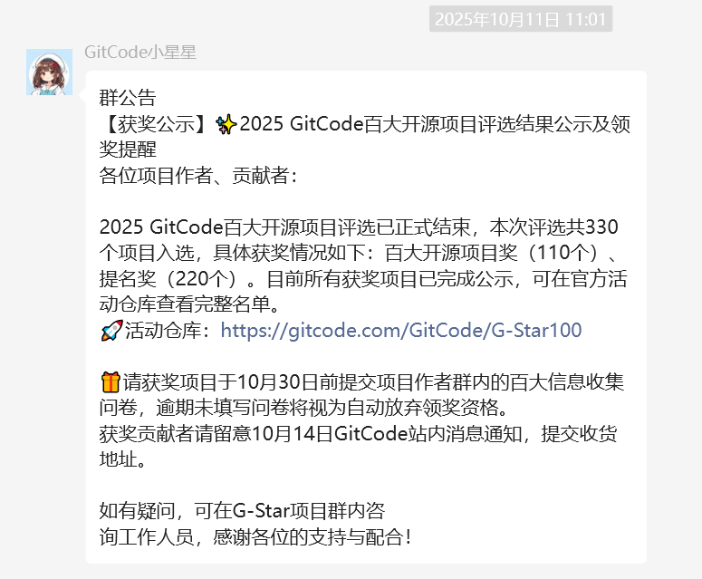
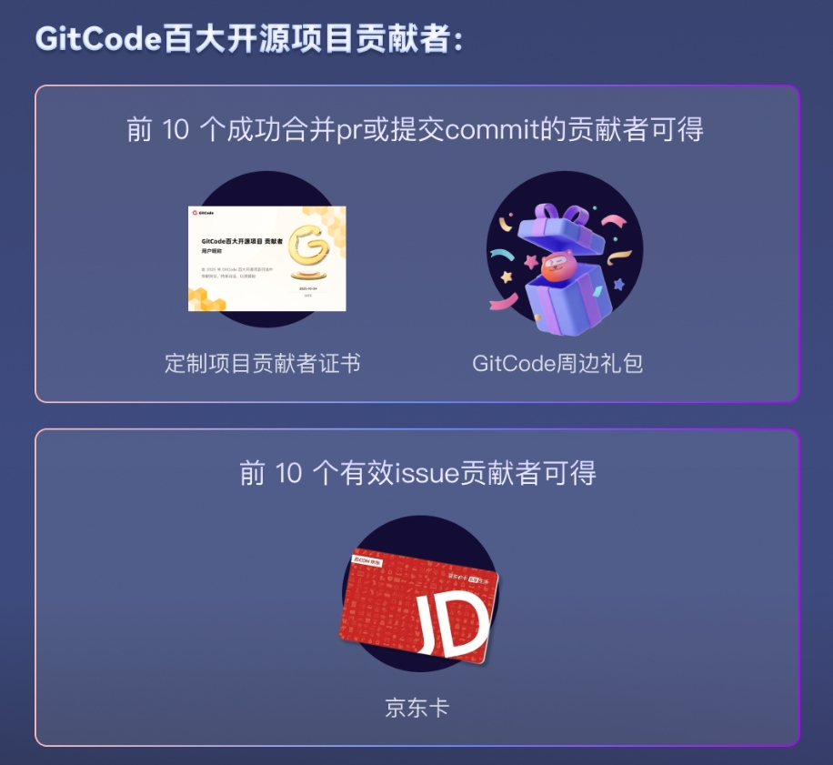
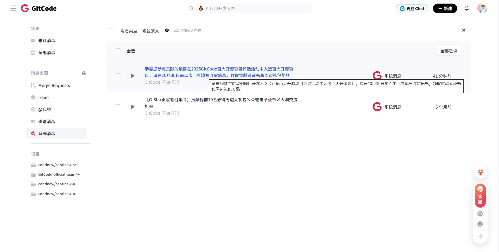

# ContiNew | GitCode 百大开源评选结束，项目均上榜，贡献者快来填写收货地址！

2025 GitCode 百大开源评选活动结束！感谢各位大佬的支持，ContiNew 目前的三个项目均上榜百大开源项目奖 ，请各项目前十位贡献者快去填写收货地址！

---

## GitCode 百大开源项目评选活动

今年6月30日，GitCode 推出了百大开源项目评选活动。有关活动说明，请查看历史文章：[《GitCode 百大开源评选！助力 ContiNew Admin 上榜，赢证书+京东卡+限量周边！》](https://mp.weixin.qq.com/s/7gz2zYjnEjkYUXs8K21Mbw)

经过三个月角逐，在国庆前夕，2025 GitCode百大开源项目评选活动结束。国庆后，官方人员进行了数据整理，评选结果已于10月11日在相关微信群推送。

完整榜单，可点击查看：https://gitcode.com/GitCode/G-Star100

## 上榜百大开源项目奖

2025 GitCode 百大开源项目评选结果：本次评选共 330 个项目入选，其中百大开源项目奖（110个）、提名奖（220个）。

衷心感谢各位大佬的支持，本次 ContiNew 三个项目均上榜百大开源项目奖，continew-admin（并列23名）、continew-admin-ui（并列68名）、continew-starter（并列100名）。

## 10月14日，贡献者填写收货地址

百大项目贡献者权益：百大项目评选期间，前10个在GitCode合并成功pr的贡献者可获得平台发出的贡献者证书（电子）+成长礼包（周边），一人仅可获得一次；前10个在GitCode提出的有效issue可获得10元京东卡，一人仅可获得一次。

由于 ContiNew 的三个项目均上榜百大项目，在6月30日至9月30日活动期间，**在 GitCode 平台参与 ContiNew 项目贡献符合要求的大佬**，请根据官方通知，**留意 10月14日 GitCode 站内消息通知，点击消息前往提交收货地址**。

