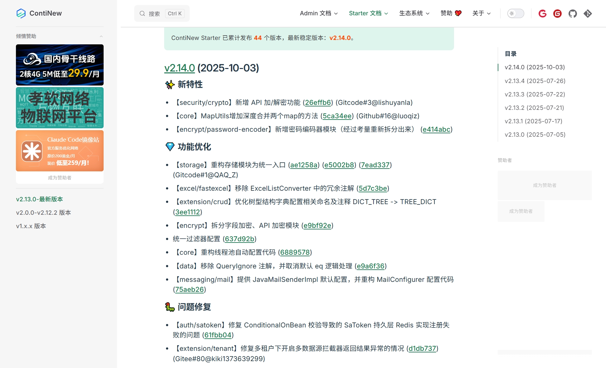
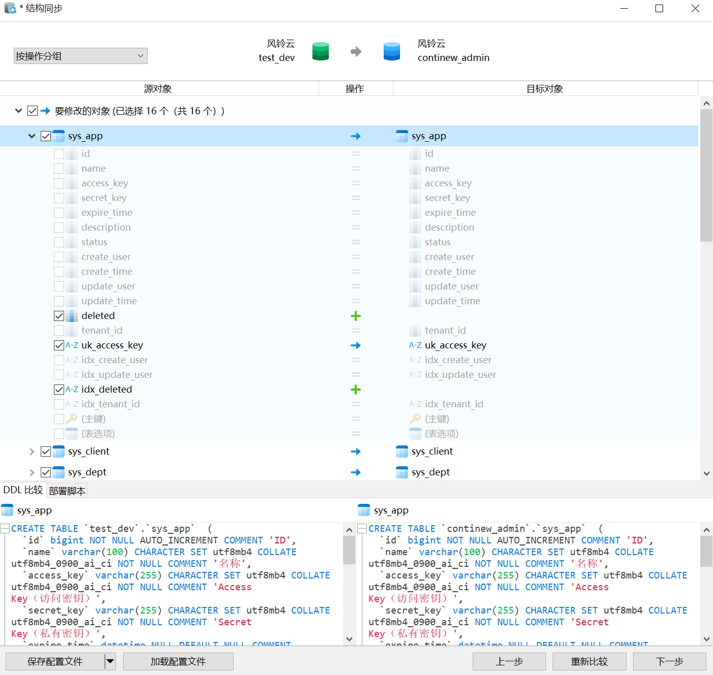
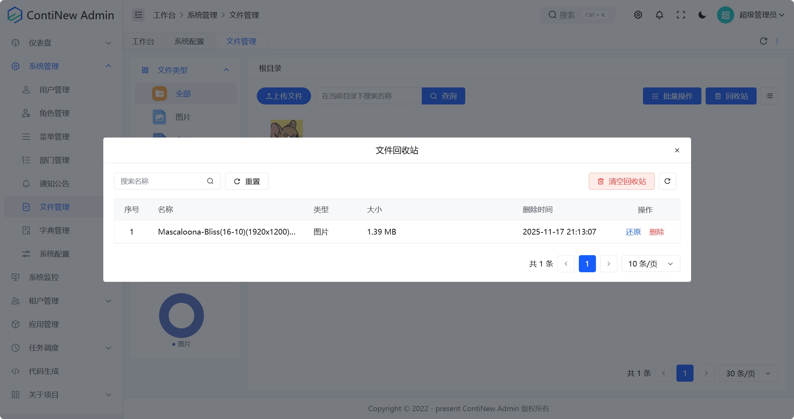
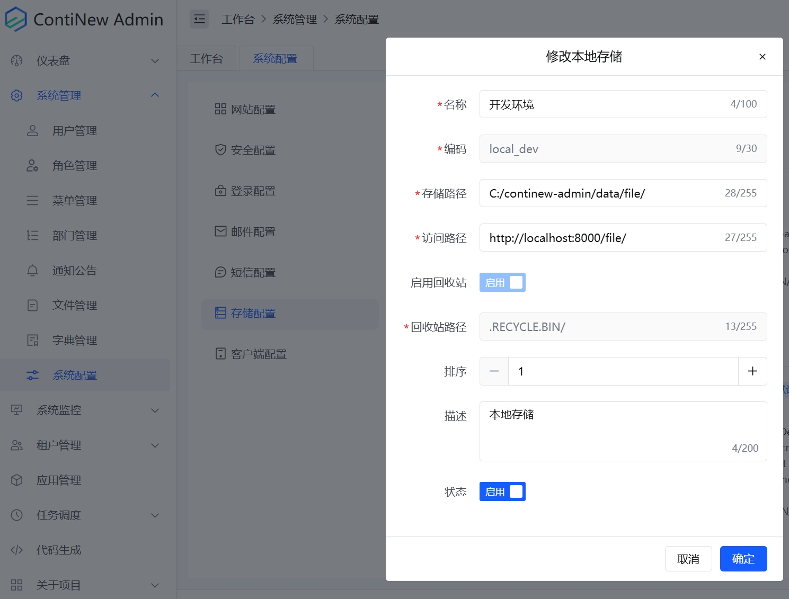
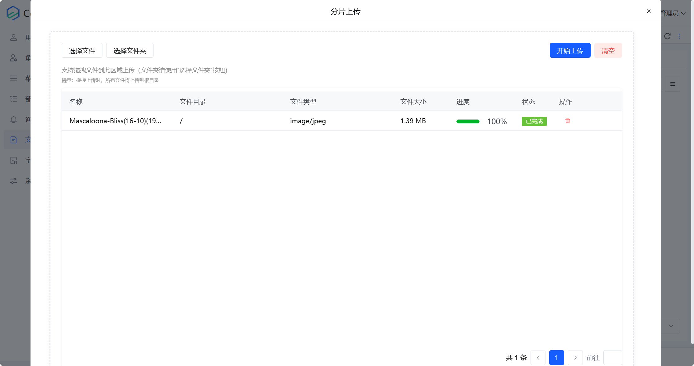
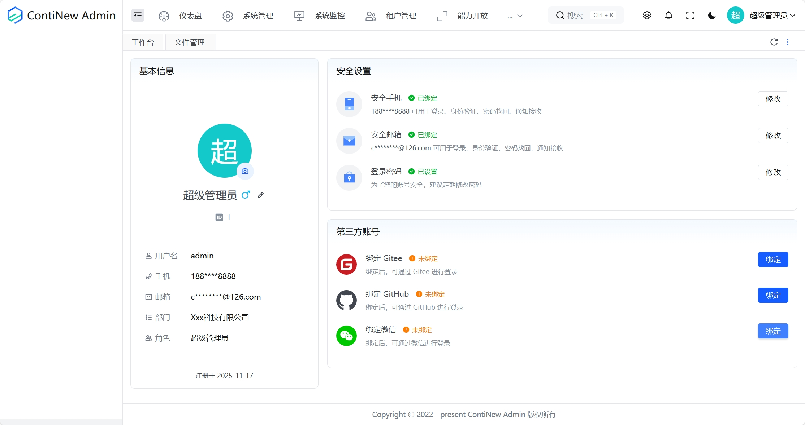
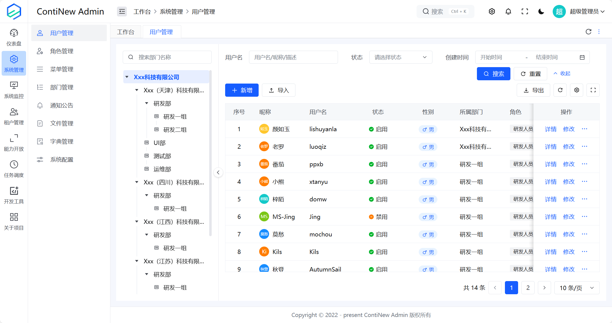
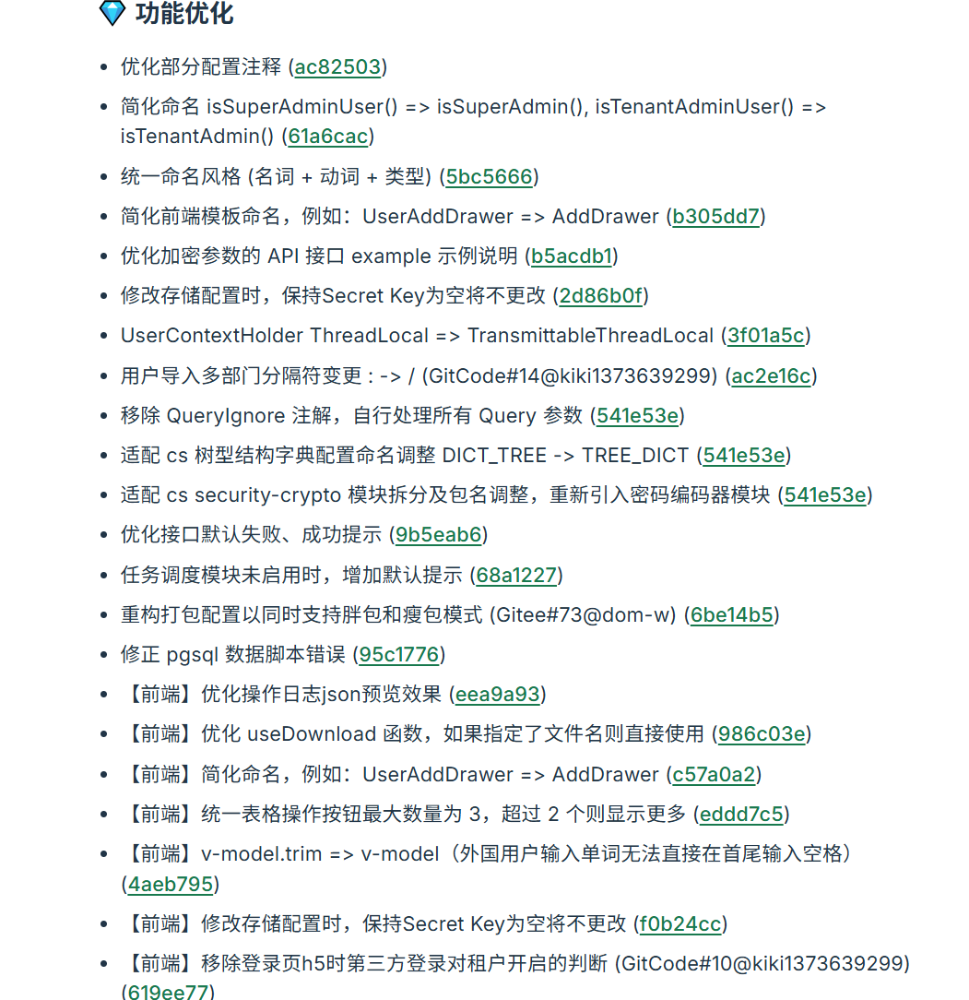
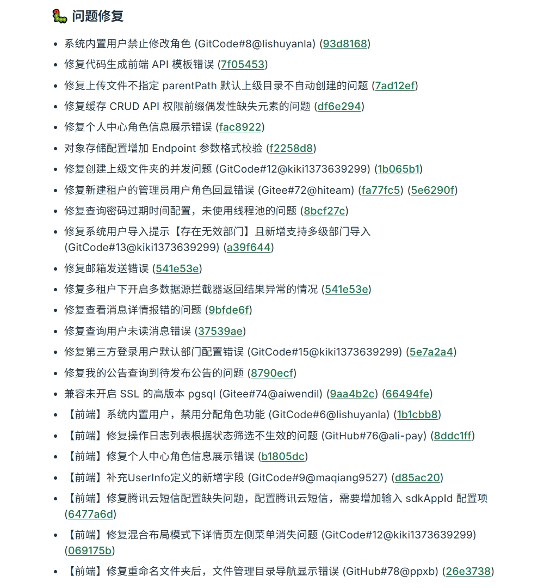

# ContiNew Admin v4.1.0 | 全局逻辑删除，文件回收站上线

ContiNew Admin v4.1.0 已正式发布！作为 v4.x 系列的第二个版本，本版本重点升级了文件管理功能，新增了文件分片上传、文件回收站等实用功能，同时引入了微信开放平台登录支持，并对系统进行了多项优化和修复。快来看看吧！

---

## ContiNew Starter 升级到 v2.14.0

作为 ContiNew Admin 的底层支撑，ContiNew Starter 从 v2.13.4 升级到了 v2.14.0，关键更新包括：

① 修复多租户下开启多数据源拦截器返回结果异常的情况

② 提供 JavaMailSenderImpl 默认配置，并重构 MailConfigurer 配置代码

③ 移除 QueryIgnore 注解，并取消默认 eq 逻辑处理

④ 优化树型结构字典配置相关命名及注释 DICT_TREE -> TREE_DICT

⑤ 新增 API 加/解密模块，还原密码编码器模块

详细更新请查阅 ContiNew Starter 更新日志。其中涉及已使用的优化和特性，ContiNew Admin 已经跟进升级，欢迎查看。

## 全局逻辑删除（适配已有唯一索引）

在本版本，我们全局开启并适配了逻辑删除。经过投票讨论[《ContiNew Admin | 头脑风暴！回收站设计投票》](https://continew.top/posts/2025/brainstorming-recycle-design.html)及综合考虑后，我们采用了如下逻辑删除表方案：

1. 增加 deleted 是否已删除字段，0：表示未删除；id：表示已删除
2. 对已有唯一索引，同步增加 deleted 字段组合为唯一索引

**目前涉及逻辑删除调整的数据表如下：** 

菜单表、部门表、角色表、用户表、用户社会化关联表、字典表、字典项表、消息表、公告表、存储表、文件表、客户端表、短信配置表、应用表、租户表、租户套餐表。

**注意事项：** 

1. 日志表、部分中间表没有增加逻辑删除字段，如果你有需要可以自行添加处理
2. 如果你的业务表不需要逻辑删除，不增加 deleted 字段即可
3. BaseDO 增加了 deleted 通用字段，如果不需要逻辑删除请不要继承

## 支持文件回收站

此外，本版本在逻辑删除的基础上还新增了文件回收站功能，删除的文件将先进入回收站，用户可以在回收站中找到已删除的文件，并根据需要进行恢复或彻底删除。（回收站文件不支持预览）

*对于文件回收站功能，这是我个人想要加的，是基于逻辑删除的角度考虑的，我希望增加一个逻辑删除应用的业务场景示例，给有需要的人打个样儿。*

如果你不需要此功能，除了删除相关代码外，我们也支持禁用文件回收站：在 [系统管理/系统配置/存储配置] 中可以对指定存储配置禁用回收站或调整回收站路径。（注意：不要在存储服务中删除对应回收站目录！）

## 初步支持文件分片上传

感谢莫愁大佬的 PR，本版本新增了第一版文件分片上传能力（也算是作为一个代码示例），支持本地存储和 S3 存储。这一功能特别适合大文件上传场景，通过分片上传可以有效提高上传成功率，减少因网络不稳定导致的上传失败。

> 分片上传：将大文件分割成多个小片段进行上传，即使某个片段上传失败，也只需重新上传该片段，而不需要重新上传整个文件，大大提高了上传效率和成功率。

## 微信开放平台登录支持

本版本新增了微信开放平台登录集成，在配置文件中配置好微信开放平台配置后，用户就可以在个人中心绑定微信账号，实现多种登录方式的灵活切换。

## 支持双列布局和顶部布局

本版本，莫愁大佬同步了 Gi-Demo 的布局更新，支持了双列布局及顶部布局选项，为产品设计增加了更多方案选择。

## 其他修复及优化

ContiNew 系列项目致力于持续迭代、持续舒适的开发体验。我们不追求迅速增加新功能，更重视闭环解决方案和代码、页面重构。此版本我们依然优化修复了大量细节，在此特别感谢为之付出努力的维护成员及社区同学。

**版本前瞻：** v4.x 大版本在我们的计划中不会迭代太久，主要会集中在完善多租户功能、优化已有模块等方面。 v5.x 将是我们的全面里程碑版本，它将带来新 UI（Element Plus）、新前端模板、更为企业级的功能完善及优化，敬请期待吧（不要问 Deadline，真的不要问，PTSD 了）。

---

如需查看 v4.1.0 中优化和特性的完整列表，请参阅 [更新日志](/docs/admin/changelog/#v4-1-0-2025-11-17)。
